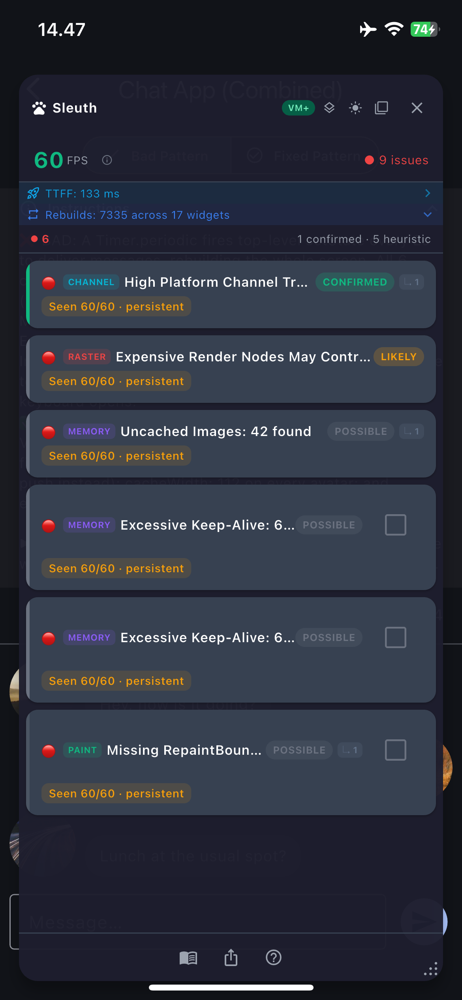
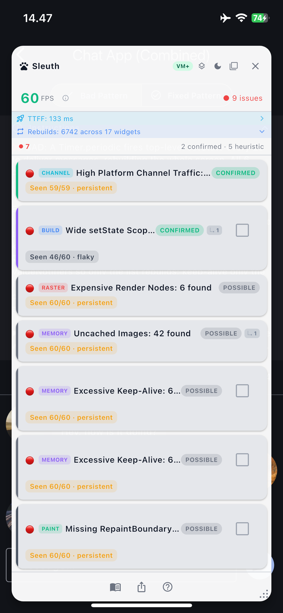

<p align="center">
  
</p>

# Sleuth

[](https://pub.dev/packages/sleuth)
[](https://flutter.dev)
[](https://opensource.org/licenses/MIT)
[]()
[]()

In-app performance diagnostics overlay for Flutter. Surfaces jank, memory leaks, slow networks, GPU pressure, and widget anti-patterns — directly inside your app, with a fix hint on every issue.

<p align="center">
  
  &nbsp;&nbsp;
  
</p>

## Why Sleuth

What it does better than DevTools:

- **Always on**: no separate tool window, no connection setup — one-line install, visible while you use the app
- **20 detectors**: structural anti-patterns DevTools does not flag (non-lazy lists, uncached images, missing RepaintBoundary, intrinsic-height layout cost, retained stream subscriptions)
- **Inline Rebuild Stats**: live rebuild counter with top-3 widget breakdown and full-list drilldown when `enableDeepDebugInstrumentation: true`
- **Confidence explanations**: every issue explains *why* its confidence is confirmed/likely/possible — what evidence was used, what would upgrade it
- **Causal issue graph**: 48 rules link root causes to downstream effects — see why an issue matters, not just that it exists
- **Fix verification**: baseline → fix → compare. Cooldown-based resolution with hot-reload grace period
- **Historical trending**: per-issue recurrence tracks worsening/improving/stable/intermittent patterns across scan cycles
- **Per-route health scores**: passive route detection (no NavigatorObserver) with per-route FPS, jank ratio, issue aggregation, composite health score
- **Network monitoring**: slow requests, request floods, oversized responses, HTTP error spikes, high-frequency same-path bursts (≥3 GET/HEAD/OPTIONS to one endpoint within 500 ms), network-to-frame correlation
- **Heap trend monitoring**: sustained memory growth + near-capacity detection without heap snapshots
- **CPU attribution on jank frames**: top-5 functions by CPU time per jank frame — no manual profiling session
- **Issue Encyclopedia**: in-app deep-dives for all 50 issue types, searchable + cross-referenced
- **Contextual AI Chat**: per-issue AI assistant with streaming responses + starter questions — bring your own provider

What DevTools still does better:

- **Heap snapshots & object graph**: DevTools can browse every object in the heap, inspect retention paths, and track individual allocations. Sleuth monitors heap trends and GC pressure but cannot drill into specific objects.
- **Full flame chart & call tree**: DevTools provides zoomable, interactive per-frame timelines with complete call tree visualization. Sleuth shows phase breakdowns with top-5 function attribution per jank frame.

Sleuth is best used for **fast in-app triage** — catch the problem, understand the category, then use DevTools when you need deeper investigation.

## How It Works

Sleuth runs four layers of analysis:

1. **Frame timing** (FrameTiming API) — per-frame build and raster duration, vsync overhead, cache stats. Works on every platform in debug and profile mode. This is the primary signal.
2. **VM timeline** (vm_service) — when connected, provides sub-phase breakdowns (buildScope, flushLayout, flushPaint, raster). Best-effort; availability depends on platform and runtime environment.
3. **Widget tree scan** (post-frame walk, 1x/sec) — finds structural anti-patterns like non-lazy lists, uncached images, missing RepaintBoundary, and more.
4. **Network monitoring** (HttpOverrides) — transparent HTTP interception that detects slow requests, frequency spikes, oversized responses, and HTTP error bursts without modifying app networking code.

## Quick Start

```dart
import 'package:sleuth/sleuth.dart';

void main() => runApp(Sleuth.track(child: MyApp()));
```

The overlay appears in debug and profile mode. Completely disabled in release builds.

## Running

```bash
# Profile mode (recommended — accurate timing data)
flutter run --profile

# Debug mode (works, but timing is less representative)
flutter run
```

## MCP Integration

Drive Sleuth from your AI assistant. The
[`sleuth_mcp`](packages/sleuth_mcp) sidecar bridges Sleuth's seven
`ext.sleuth.*` VM service extensions to MCP clients (Claude Code, Cursor,
Zed), so the assistant can query live issues, route health, and snapshots
in conversation — same signals as the overlay, with `connectionMode`
reported honestly (`correlated` / `full` / `basic` / `warmup` /
`disconnected`) instead of empty data.

Opt-in; most developers only need the in-app overlay. Sleuth reserves the
`ext.sleuth.*` namespace — other packages should choose a distinct prefix
to avoid `dart:developer.registerExtension` collisions.

For MCP-only sessions where the AI client is the sole consumer, set
`SleuthConfig(showOverlay: false)` to hide the trigger button and dashboard
while detectors and the `ext.sleuth.*` extensions keep running.

## Debug vs Profile Mode

Both modes run the full overlay, all 20 detectors, and the AI chat. The difference is **what data each mode can access** and **how accurate the timing is**.

| Capability | Debug | Profile | Release |
|------------|:-----:|:-------:|:-------:|
| Overlay & all detectors | Yes | Yes | Disabled |
| Frame timing accuracy | Inflated by debug overhead | Production-accurate | — |
| VM timeline (build/layout/paint durations) | Yes | Yes | — |
| Source location in issues (`file.dart:42`) | Yes | No | — |
| Per-widget rebuild/paint attribution | Yes (opt-in) | Via VM timeline only | — |
| Deep timeline enrichment (dirty lists) | Yes (opt-in) | No | — |
| AI Chat & Issue Encyclopedia | Yes | Yes | — |

### When to use which

- **Profile mode** for performance investigation — timing is real, no debug overhead inflating numbers. This is what you should trust.
- **Debug mode** for root-cause drilling — source locations pinpoint the exact file:line, and opt-in debug callbacks give per-widget rebuild/paint counts. Verify timing fixes in profile mode afterward.

### Debug-only opt-in features

These add overhead and are off by default. Enable them when you need deeper attribution:

```dart
SleuthConfig(
  enableDebugCallbacks: true,        // per-widget rebuild & paint counts
  enableDeepDebugInstrumentation: true, // timeline dirty lists & per-widget build/layout/paint events
)
```

## Platform Support

| Platform | Frame Timing | VM Full Mode | Notes |
|----------|:---:|:---:|-------|
| Android device | Yes | Best-effort | Background reconnect ladder retries on cold-start port bind race |
| Android emulator | Yes | Best-effort | Same adb limitation applies |
| iOS device | Yes | Good | Profile mode recommended |
| Desktop | Yes | Good | Strongest VM connectivity |

**Frame timing mode** is the universal cross-platform path and provides accurate build/raster timing in profile builds.

**VM full mode** adds sub-phase breakdown (build vs layout vs paint vs raster) but depends on VM service connectivity, which varies by platform. The package falls back gracefully to frame timing mode when VM is unavailable. On cold start, a background reconnect ladder (500 ms → 30 s, 7 attempts) automatically upgrades to full mode once the VM web server binds — no manual action needed.

> **Prefer VM+ (full) mode for accurate, complete diagnostics.** In `basic` mode (no VM self-connect) the VM-only detectors stay silent — `heap_growing`, `heavy_compute`, `excessive_repaint`, `gc_pressure`, `stream_resource` never fire, and structural confidence is capped at `possible`. The issue list is real but **incomplete**, so don't trust "no memory/repaint issues" until `Sleuth.diagnose()` reports `full` / `correlated`. Reach it via `--no-dds` (below).

### Reaching full mode

`flutter run` defaults to starting **DDS** (Dart Development Service), which claims the device's VM service as its sole client. That blocks sleuth's in-process self-connect, so it stays in frame-timing mode for the session.

Skip DDS to let sleuth self-connect on the first run — no relaunch:

```bash
flutter run --profile --no-dds
```

The VM service stays multi-client, so sleuth connects alongside the tooling and `Sleuth.diagnose()` reports `connectionMode: full` (or `correlated`). Hot reload/restart are unaffected; you lose DDS-only niceties (smoother multi-client DevTools, log history).

Full mode runs periodic VM polling on the app isolate. On real devices the cost is negligible — but on **emulators/simulators** (software rendering, weak CPU) it can noticeably depress FPS. Measure frame rates on a real device, not an emulator.

Fallback (when you need DDS + DevTools + sleuth at once): launch the installed binary directly so no DDS attaches —

**Android:**
```bash
flutter run --profile -d <id>          # build + install once, then quit (q)
adb -s <id> shell am start -n com.example.example/.MainActivity
adb -s <id> logcat -d | grep "Dart VM service"
adb -s <id> forward tcp:<port> tcp:<port>   # for sleuth_mcp / external tooling
```

**iOS simulator:**
```bash
flutter run --profile -d <id>          # build + install once, then quit (q)
xcrun simctl launch booted com.example.example
# capture the URI: xcrun simctl spawn booted log stream | grep "Dart VM service"
```

Either path: `Sleuth.diagnose()` (or `sleuth_mcp`'s `diagnose` tool) reports `connectionMode: full` / `correlated`.

## FPS Semantics

Sleuth exposes two frame-rate metrics:

- **Actual FPS** — frames actually presented in the last 1 second, counted from `FrameTiming.rasterFinish` timestamps in a rolling window. This is what the device drew.
- **Throughput FPS** — latency-derived capacity estimate from average frame duration (`1e6 / avg(frame_duration_us)`). This is what the engine could produce given current per-frame cost.

The overlay shows **Throughput FPS** as the primary numeral (color-coded vs `fpsTarget`). Idle screens read smooth because Flutter only repaints on change — Actual FPS would collapse to a few frames/sec on a static screen even though rendering is healthy. Tap the info icon to reveal both metrics side-by-side (ACTUAL + TPUT). Session exports (`SessionSnapshot` schema v5) carry both metrics plus `actualFpsRaw` — the device rate capped at 240 Hz, useful on ProMotion 120 Hz hardware where the overlay clamps to `fpsTarget`.

Edge cases — ProMotion `fpsTarget` clamping, the warm-up placeholder, Impeller raster-cache zeros, batched-callback anchoring — and the FrameTiming-vs-vsync measurement methodology are covered in [Internals](https://github.com/Harrys76/sleuth/blob/main/doc/internals.md).

## Configuration

### Quick start

First-time integration? Drop in a preset instead of reading 25 field docs:

```dart
// Safe defaults, structural + runtime detectors only.
Sleuth.track(
  child: MyApp(),
  config: SleuthConfig.minimal(),
);

// Or optimise for low overhead in CI / profile runs.
Sleuth.track(
  child: MyApp(),
  config: SleuthConfig.performance(),
);
```

### Full configuration

```dart
Sleuth.track(
  child: MyApp(),
  config: SleuthConfig(
    fpsTarget: 60,
    rebuildThreshold: 10,
    maxListChildren: 20,
    platformChannelLimit: 20,
    treeScanInterval: Duration(seconds: 1),
    captureBufferCapacity: 50,        // max jank frames retained for export
    enableDebugCallbacks: false,       // opt-in: per-widget rebuild/repaint hooks (conflicts with DevTools)
    enableDeepDebugInstrumentation: false, // opt-in: heavy per-widget timeline events
    maxTrackedTypes: 200,              // cap on tracked widget types in debug callbacks
    enableNetworkMonitoring: true,     // HTTP interception via HttpOverrides
    slowRequestThresholdMs: 1000,         // warn on requests slower than this (default 1000 ms)
    criticalSlowRequestThresholdMs: 3000, // escalate to critical at this duration (must be > slow; default 3000 ms)
    requestFrequencyLimit: 30,         // max requests per 5s window
    largeResponseThresholdBytes: 1048576, // flag responses larger than 1MB
    adaptiveScanEnabled: true,         // back off scan interval when app is healthy (default true)
    networkExcludePatterns: ['analytics.example.com'], // exclude URLs from monitoring
    enabledDetectors: {
      DetectorType.frameTiming,
      DetectorType.rebuild,
      DetectorType.imageMemory,
      // ... add only the detectors you need
    },
    suppressedIssues: {'non_lazy_list', 'font_*'}, // hide known issues by stableId (exact or wildcard)
    thresholds: DetectorThresholds(
      shaderJankMs: 50,              // shader compilation warning threshold
      heavyComputeGapMs: 8,          // heavy compute warning gap (critical at 2× = 16ms)
      gpuPressureRatio: 1.5,         // raster/UI time ratio for GPU pressure
    ),
    customDetectors: [MyCustomDetector()], // plug in domain-specific detectors
    disabledCustomDetectorKeys: {'my_heavy_detector'}, // gate custom detectors by key
    triggerButtonAlignment: Alignment.bottomRight, // initial trigger button corner
    triggerButtonOffset: Offset(16, 16),           // pixel offset from corner
    showDebugModeBanner: true,         // dismissible debug-mode warning banner
    showOverlay: true,                 // false hides overlay UI (trigger + dashboard); detectors + ext.sleuth.* keep running — for MCP-only sessions
    routeIgnorePatterns: {'/dialog*'}, // routes to exclude from tracking (exact or trailing *)
    routeHistoryCapacity: 20,          // max route sessions retained (FIFO)
  ),
);
```

**Debug callbacks note:** `enableDebugCallbacks` installs `debugOnRebuildDirtyWidget` and `debugOnProfilePaint` hooks. These conflict with DevTools "Track Widget Rebuilds" — only one can be active at a time. Default `false` to avoid surprising DevTools users.

**Overlay theming:** The overlay auto-detects light/dark backgrounds. A built-in toggle in the overlay header lets you switch themes at runtime. You can also override programmatically:

```dart
// Static config at initialization
Sleuth.track(
  child: MyApp(),
  config: SleuthConfig(
    theme: SleuthThemeData.light().copyWith(
      cardBackground: Color(0xFFF5F5F5),
      spacingMd: 10, // adjust overlay density (default 8)
    ),
  ),
);

// Runtime toggle (from anywhere in your app)
Sleuth.updateTheme(const SleuthThemeData.light()); // force light
Sleuth.updateTheme(null);                          // revert to auto-detect
```

## AI Chat

Tap "Ask AI" on any issue card to open a contextual AI chat. The package builds a rich system prompt from issue metrics, encyclopedia knowledge, and the causal graph — your AI provider just needs to stream a response.

```dart
Sleuth.track(
  child: MyApp(),
  config: SleuthConfig(
    aiChat: AiChatAdapter.anthropic(apiKey: myKey),
    // Or: AiChatAdapter.openAi(apiKey: myKey)
    // Or: AiChatAdapter.google(apiKey: myKey)
  ),
);
```

Custom backend:

```dart
config: SleuthConfig(
  aiChat: AiChatAdapter(
    sendMessage: (request) async* {
      // request.systemPrompt — rich issue context built by the package
      // request.history — full conversation so far
      yield* myBackend.stream(request);
    },
  ),
),
```

Built-in adapters automatically exclude their provider URLs from network monitoring. When no adapter is configured, the "Ask AI" link is hidden.

## Custom Detectors

Plug in domain-specific detectors alongside the built-in 20. Three shapes are supported:

**Structural** — inspect widgets during the tree walk using `SimpleStructuralDetector`:

```dart
class TooltipUsageDetector extends SimpleStructuralDetector {
  TooltipUsageDetector()
      : super(
          name: 'Tooltip Usage',
          description: 'Flags Tooltip widgets in the tree',
          key: 'tooltip_usage',
        );

  @override
  void inspect(Element element) {
    if (element.widget is Tooltip) {
      report(
        element: element,
        title: 'Tooltip detected',
        detail: 'Consider Semantics instead for accessibility.',
        category: IssueCategory.build,
      );
    }
  }
}
```

**Runtime** — observe app events (frame timings, route transitions) by extending `BaseDetector` directly with `DetectorLifecycle.runtime`.

**Hybrid** — combine VM timeline data with tree inspection using `DetectorLifecycle.hybrid`.

See the three-file cookbook in `example/lib/custom_detectors/` for complete examples of all three shapes.

Register custom detectors and optionally gate them by key:

```dart
Sleuth.track(
  child: MyApp(),
  config: SleuthConfig(
    customDetectors: [TooltipUsageDetector(), SlowFrameDetector()],
    disabledCustomDetectorKeys: {'slow_frame_detector'}, // disable by key
  ),
);
```

## Session Export

Export captured jank data and current issues for sharing or comparison:

```dart
// JSON snapshot (full data — frame stats, issues, causal edges, heat map)
final snapshot = Sleuth.exportSnapshot();
final json = Sleuth.exportSnapshotJson();

// Markdown summary (human-readable — paste into Slack or a PR description)
final markdown = Sleuth.exportSummary(topN: 5);
```

The dashboard includes an export button that copies the JSON snapshot to the clipboard, and a "Copy conversation" button on the AI chat page that serializes the full thread.

Exports include recurrence trends (per-issue worsening/improving/stable/intermittent), widget heat map (top offending widgets by cumulative ranking score), and per-route health data (FPS, jank ratio, issue counts, health scores).

Returns `null` in release mode, before `track()` is called, or after overlay disposal.

## Route Scoping

Sleuth passively detects route changes via the element tree — no `NavigatorObserver` needed. Each route gets its own `RouteSession` with per-route FPS, jank ratio, issue snapshots, and a composite health score (0–100).

```dart
// Access route history programmatically
final history = Sleuth.routeHistory; // List<RouteSession>?
final score = Sleuth.routeHealthScore('/settings'); // int?
```

Route health data is included in both JSON and markdown exports. Configure route tracking:

```dart
SleuthConfig(
  routeIgnorePatterns: {'/dialog*', '/splash'}, // skip ephemeral routes
  routeHistoryCapacity: 50,                      // max sessions retained (FIFO)
)
```

**Per-tab sessions for tab shells.** Bottom-nav apps using `IndexedStack`, `StatefulShellRoute.indexedStack`, or `CupertinoTabScaffold` share one `ModalRoute` across all tabs but give each tab its own `Scaffold`. Sleuth keys sessions on `(routeName, scaffoldHashKey)`, so every tab produces a distinct `RouteSession` instead of conflating tabs under a single route name. Repeat visits to the same tab are disambiguated via `tabVisitIndex` (1-indexed ordinal). Inline `TabBar` / `TabBarView` / `PageView` swipes within a single route stay inside the outer session. `PerformanceIssue.routeName` is preserved raw for group-by-route filtering — use `issue.routeDisplayName` for human-facing labels (e.g. `"/home (tab-2)"` on the second visit).

## Confidence Levels

Issues include a confidence level reflecting evidence quality:

| Level | Meaning | Example |
|-------|---------|---------|
| **Confirmed** | Directly observed runtime condition | Jank frame measured at 32ms |
| **Likely** | Runtime signal + structural evidence | Raster-dominant frame + deep opacity subtree |
| **Possible** | Structural heuristic only | Non-lazy list with 50 children found |

## Recurrence Badge

Each issue card shows a `Seen X/Y · {label}` badge once Sleuth has observed the issue across at least two scan cycles. It tells you how sticky the issue is and whether it is getting better or worse.

- **X** — scan cycles where the issue fired (`presentCount`).
- **Y** — total scan cycles in the ring buffer (capacity `60`, oldest evicted).

The label summarises the recent trend — `worsening` / `persistent` / `stable` / `improving` / `flaky`. Exact thresholds and the `flaky`↔`intermittent` / `persistent` JSON-vs-UI vocabulary notes are in [Internals](https://github.com/Harrys76/sleuth/blob/main/doc/internals.md#recurrence-badge).

Severity for warnings auto-escalates to critical after 30 consecutive scan cycles — a `Seen 30/30 · persistent` warning will flip red on the next cycle. See [`RecurrenceTrend`](lib/src/models/recurrence_trend.dart) for the underlying thresholds.

## Startup Tracing

Sleuth measures cold-start performance via `Sleuth.init()` + `Sleuth.markInteractive()`. Call `Sleuth.init()` as the first line of `main()`:

```dart
void main() {
  Sleuth.init();          // Dart-entry clock starts here
  runApp(Sleuth.track(child: const MyApp()));
}
```

Captures four metrics — `ttffMs` (Dart entry → first frame; the Dart-controlled budget, default 1500 ms warn / 3000 ms critical), `engineTtffMs` (matches `flutter run --trace-startup`), `preDartOverheadMs` (native pre-Dart phase, outside Dart's control), and `frameworkInitMs`. Per-metric windows and platform guidance in [Internals](https://github.com/Harrys76/sleuth/blob/main/doc/internals.md#startup-tracing).

In-app Startup Metrics page has full methodology + per-phase breakdown.

## Detector Matrix

20 detectors across four lifecycle types:

- **Runtime** (always available) — Frame Timing, Network Monitor, Tracked Resource.
- **VM-only** (need a VM connection) — Shader Jank, Heavy Compute, Platform Channel, Memory Pressure, Stream Resource.
- **Hybrid** (VM + tree scan, degrade gracefully) — Rebuild, GPU Pressure, Repaint.
- **Structural** (tree scan only) — setState Scope, Layout Bottleneck, ListView, Image Memory, CustomPainter, Keep Alive, Font Loading, RepaintBoundary, Startup.

Full matrix — signal source, what each can prove, confidence, and known limitations — in [Internals](https://github.com/Harrys76/sleuth/blob/main/doc/internals.md#detector-matrix).

## Validation Ledger

Each detector carries a `DetectorMetadata` record declaring the strongest evidence backing its current thresholds and heuristics, ordered across four tiers: `unvalidated` → `reproducerOnly` → `runtimeVerified` → `externallyCited`. As of v0.30.0, **18/20 detectors ship at `reproducerOnly` base and 2/20 at `runtimeVerified` base**, with **15 effective `runtimeVerified` family-severity pairs across 12 unique stableIds** (`slow_request {warning + critical}`, `large_response.warning`, `request_frequency.warning`, `heap_growing.warning`, `platform_channel_traffic.warning`, `jank_detected.warning`, `rebuild_activity {warning + critical}`, `heavy_compute {warning + critical}`, `excessive_repaint.warning`, `stream_resource_growth.warning`, `tracked_resource_concurrent.warning`, `tracked_resource_long_lived.warning`). Zero detectors at `unvalidated`. The CI audit gate at `test/validation/detector_metadata_audit_test.dart` enforces the contract on every test run.

The per-detector ledger lives at [`doc/validation_ledger.md`](https://github.com/Harrys76/sleuth/blob/main/doc/validation_ledger.md) — it names each detector's current tier, links to its reproducer when one exists, and explains what would raise it. Tier raises land the supporting reproducer or capture evidence in the same PR.

## Unsupported Claims

To set clear expectations:

- This package is **not a replacement** for DevTools heap snapshots or interactive flame charts — it covers breadth (20 detectors, encyclopedia, AI chat) but not the depth of object-level introspection or zoomable timelines
- **Widget attribution varies by mode** — debug mode provides exact per-widget rebuild/paint counts and source file:line locations. Profile mode provides per-widget-type attribution via VM timeline dirty lists (when VM is connected), falling back to structural heuristics when unavailable. See [Debug vs Profile Mode](#debug-vs-profile-mode) for the full matrix
- **VM full mode availability** depends on runtime environment and is not guaranteed on all platforms
- **Memory pressure detection** monitors GC frequency, heap growth trends (linear regression), and capacity thresholds. When growth is detected, enriches the issue with per-class allocation deltas — but does not track individual object leaks or retention paths
- **CPU attribution** is statistical (~1 kHz sampling) — functions running <1 ms may not appear; use DevTools CPU profiler for complete call trees

## Tips & Troubleshooting

iOS profile builds archived via `fastlane gym` can lose `file.dart:42` source locations — a stale `TRACK_WIDGET_CREATION=false` in `Generated.xcconfig` strips them. Cause + the Fastfile patch are in [Internals](https://github.com/Harrys76/sleuth/blob/main/doc/internals.md#ios-profile-builds-via-fastlane-lose-source-locations).

## Example App

20 demo screens + 7 capture-helper screens with Before/After toggle + live metrics. See [`example/README.md`](example/README.md) for the full screen list and demo categorization.

```bash
cd example && flutter run --profile
```

## License

MIT
