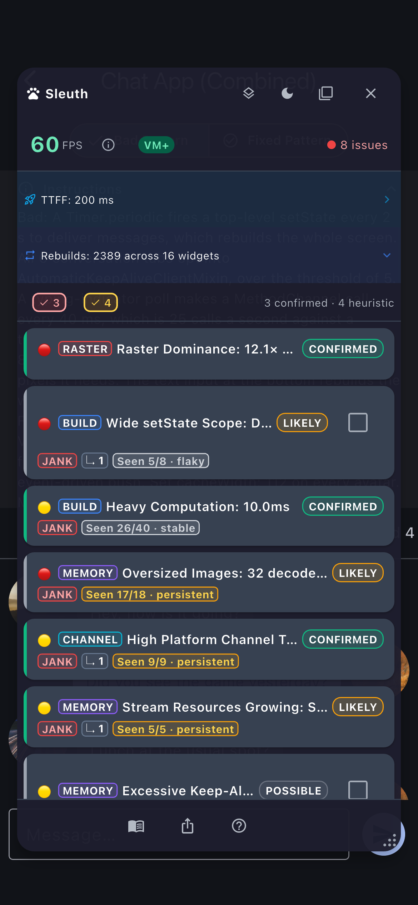
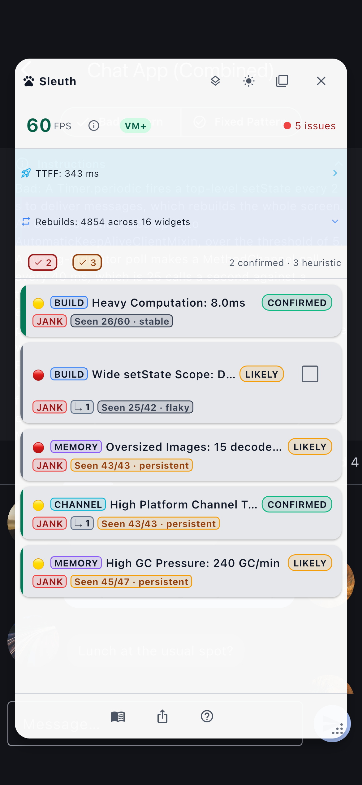

<p align="center">
  
</p>

# Sleuth

[](https://pub.dev/packages/sleuth)
[](https://flutter.dev)
[](https://opensource.org/licenses/MIT)
[]()
[]()

In-app performance diagnostics overlay for Flutter. Surfaces jank, memory leaks, slow networks, GPU pressure, and widget anti-patterns — directly inside your app, with a fix hint on every issue.

<p align="center">
  
  &nbsp;&nbsp;
  
</p>

## Why Sleuth

What it does better than DevTools:

- **Always on**: no separate tool window, no connection setup — one-line install, visible while you use the app
- **20 detectors**: structural anti-patterns DevTools does not flag (non-lazy lists, images decoded above display size, missing RepaintBoundary, intrinsic-height layout cost, retained stream subscriptions)
- **Inline Rebuild Stats**: live rebuild counter with top-3 widget breakdown and full-list drilldown when `enableDeepDebugInstrumentation: true`
- **Confidence explanations**: every issue explains *why* its confidence is confirmed/likely/possible — what evidence was used, what would upgrade it
- **Causal issue graph**: 41 rules link root causes to downstream effects — see why an issue matters, not just that it exists
- **Fix verification**: baseline → fix → compare. Cooldown-based resolution with hot-reload grace period
- **Historical trending**: per-issue recurrence tracks worsening/improving/stable/intermittent patterns across scan cycles
- **Per-route health scores**: passive route detection (no NavigatorObserver) with per-route FPS, jank ratio, issue aggregation, composite health score
- **Network monitoring**: slow requests, request floods, oversized responses, HTTP error spikes, high-frequency same-path bursts (≥3 GET/HEAD/OPTIONS to one endpoint within 500 ms), network-to-frame correlation
- **Heap trend monitoring**: sustained memory growth + near-capacity detection without heap snapshots
- **CPU attribution on jank frames**: top-5 functions by CPU time for a jank frame, requested at most once per 10 s — no manual profiling session
- **Issue Encyclopedia**: in-app deep-dives for every issue type the detectors emit (entries for detectors removed in 0.20.0 are labelled legacy), searchable + cross-referenced
- **Contextual AI Chat**: per-issue AI assistant with streaming responses + starter questions — bring your own provider

What DevTools still does better:

- **Heap snapshots & object graph**: DevTools can browse every object in the heap, inspect retention paths, and track individual allocations. Sleuth monitors heap trends and GC pressure but cannot drill into specific objects.
- **Full flame chart & call tree**: DevTools provides zoomable, interactive per-frame timelines with complete call tree visualization. Sleuth shows phase breakdowns with top-5 function attribution for jank frames (at most one request per 10 s).

Sleuth is best used for **fast in-app triage** — catch the problem, understand the category, then use DevTools when you need deeper investigation.

## How It Works

Sleuth runs four layers of analysis:

1. **Frame timing** (FrameTiming API) — per-frame build and raster duration, vsync overhead, cache stats. Works on every platform in debug and profile mode. This is the primary signal.
2. **VM timeline** (vm_service) — when connected, provides sub-phase breakdowns (buildScope, flushLayout, flushPaint, raster). Best-effort; availability depends on platform and runtime environment. Sleuth polls every 500 ms, fetching only the events written since the previous poll (plus a 500 ms overlap it deduplicates) and never clearing the VM timeline, so DevTools keeps its view; each poll's own cost is reported by `Sleuth.lastPollTimings` and `ext.sleuth.diagnose`.
3. **Widget tree scan** (post-frame walk, 1x/sec) — finds structural anti-patterns like non-lazy lists, oversized images, missing RepaintBoundary, and more.
4. **Network monitoring** (HttpOverrides) — transparent HTTP interception that detects slow requests, frequency spikes, oversized responses, and HTTP error bursts without modifying app networking code. Only `dart:io` `HttpClient` traffic is observed; `cronet_http`, `cupertino_http`, and platform-SDK networking are invisible.

## Quick Start

```dart
import 'package:sleuth/sleuth.dart';

void main() => runApp(Sleuth.track(child: MyApp()));
```

The overlay appears in debug and profile mode. Completely disabled in release builds.

Requires Flutter 3.32 or later (Dart 3.8 or later).

## Running

```bash
# Profile mode (recommended — accurate timing data)
flutter run --profile

# Debug mode (works, but timing is less representative)
flutter run
```

## MCP Integration

Drive Sleuth from your AI assistant. The
[`sleuth_mcp`](packages/sleuth_mcp) sidecar bridges Sleuth's seven
`ext.sleuth.*` VM service extensions to MCP clients (Claude Code, Cursor,
Zed), so the assistant can query live issues, route health, and snapshots
in conversation — same signals as the overlay, with `connectionMode`
reported honestly (`correlated` / `full` / `basic` / `warmup` /
`disconnected`) instead of empty data.

Opt-in; most developers only need the in-app overlay. Sleuth reserves the
`ext.sleuth.*` namespace — other packages should choose a distinct prefix
to avoid `dart:developer.registerExtension` collisions.

For MCP-only sessions where the AI client is the sole consumer, set
`SleuthConfig(showOverlay: false)` to hide the trigger button and dashboard
while detectors and the `ext.sleuth.*` extensions keep running.

## Debug vs Profile Mode

Both modes run the full overlay, all 20 detectors, and the AI chat. The difference is **what data each mode can access** and **how accurate the timing is**.

| Capability | Debug | Profile | Release |
|------------|:-----:|:-------:|:-------:|
| Overlay & all detectors | Yes | Yes | Disabled |
| Frame timing accuracy | Inflated by debug overhead | Production-accurate | — |
| VM timeline (build/layout/paint durations) | Yes | Yes | — |
| Source location in issues (`file.dart:42`) | Yes | No | — |
| Per-widget rebuild/paint attribution | Yes (opt-in) | Via VM timeline only | — |
| Deep timeline enrichment (dirty lists) | Yes (opt-in) | Yes (opt-in) | — |
| AI Chat & Issue Encyclopedia | Yes | Yes | — |

### When to use which

- **Profile mode** for performance investigation — timing is real, no debug overhead inflating numbers. This is what you should trust.
- **Debug mode** for root-cause drilling — source locations pinpoint the exact file:line, and opt-in debug callbacks give per-widget rebuild/paint counts. Verify timing fixes in profile mode afterward.

### Opt-in deep instrumentation

These add overhead and are off by default. Enable them when you need deeper attribution. Source locations (`file.dart:42`) remain debug-only, but `enableDeepDebugInstrumentation` also works in profile mode:

```dart
SleuthConfig(
  enableDebugCallbacks: true,        // per-widget rebuild & paint counts
  enableDeepDebugInstrumentation: true, // timeline dirty lists & per-widget build/layout/paint events
)
```

## Platform Support

| Platform | Frame Timing | VM Full Mode | Notes |
|----------|:---:|:---:|-------|
| Android device | Yes | Best-effort | Background reconnect ladder retries on cold-start port bind race |
| Android emulator | Yes | Best-effort | Same adb limitation applies |
| iOS device | Yes | Good | Profile mode recommended |
| Desktop | Yes | Good | Strongest VM connectivity |

**Frame timing mode** is the universal cross-platform path and provides accurate build/raster timing in profile builds.

**VM full mode** adds sub-phase breakdown (build vs layout vs paint vs raster) but depends on VM service connectivity, which varies by platform. The package falls back gracefully to frame timing mode when VM is unavailable. On cold start, a background reconnect ladder (500 ms → 30 s, 7 attempts) automatically upgrades to full mode once the VM web server binds — no manual action needed.

> **Prefer VM+ (full) mode for accurate, complete diagnostics.** In `basic` mode (no VM self-connect) the VM-only detectors stay silent — `heap_growing`, `heavy_compute`, `excessive_repaint`, `gc_pressure`, `stream_resource_growth` never fire, and structural heuristics stay at `possible` (measured structural signals still reach `likely` without a VM — `uncached_images`, for example, compares decoded and rendered image sizes). The issue list is real but **incomplete**, so don't trust "no memory/repaint issues" until the `connectionMode` field on any `ext.sleuth.*` response (surfaced by the `sleuth_mcp` `diagnose` tool) reads `full` / `correlated`, or in-app `Sleuth.diagnoseCaptureState().vmConnected` is `true`. Reach it via `--no-dds` (below).

### Reaching full mode

`flutter run` defaults to starting **DDS** (Dart Development Service), which claims the device's VM service as its sole client. That blocks sleuth's in-process self-connect, so it stays in frame-timing mode for the session.

Skip DDS to let sleuth self-connect on the first run — no relaunch:

```bash
flutter run --profile --no-dds
```

The VM service stays multi-client, so sleuth connects alongside the tooling and the `connectionMode` field on `ext.sleuth.*` responses reads `full` (or `correlated`). Hot reload/restart are unaffected; you lose DDS-only niceties (smoother multi-client DevTools, log history).

Full mode runs periodic VM polling on the app isolate, and the cost scales with how many timeline events the app writes. On an iPhone 12 (profile, 500 ms polls) an idle screen costs about 1.5 ms of UI-isolate time per poll; an FPS stress screen writing about 10k events per poll costs about 32 ms per poll, mostly decoding the response (see [doc/internals.md](doc/internals.md)). To attribute a stall, read `Sleuth.lastPollTimings` (`uiBlockingMicros` is the synchronous decode + parse + dispatch time) or the `lastPoll*` / `maxPoll*` keys of `ext.sleuth.diagnose`. On **emulators/simulators** (software rendering, weak CPU) polling can noticeably depress FPS. Measure frame rates on a real device, not an emulator.

Fallback (when you need DDS + DevTools + sleuth at once): launch the installed binary directly so no DDS attaches —

**Android:**
```bash
flutter run --profile -d <id>          # build + install once, then quit (q)
adb -s <id> shell am start -n com.example.example/.MainActivity
adb -s <id> logcat -d | grep "Dart VM service"
adb -s <id> forward tcp:<port> tcp:<port>   # for sleuth_mcp / external tooling
```

**iOS simulator:**
```bash
flutter run --profile -d <id>          # build + install once, then quit (q)
xcrun simctl launch booted com.example.example
# capture the URI: xcrun simctl spawn booted log stream | grep "Dart VM service"
```

Either path: the `connectionMode` field on every `ext.sleuth.*` response (surfaced by `sleuth_mcp`'s `diagnose` tool) reads `full` / `correlated`; in-app, `Sleuth.diagnoseCaptureState().vmConnected` is `true`.

## FPS Semantics

Sleuth exposes two frame-rate metrics:

- **Actual FPS** — frames actually presented in the last 1 second, counted from `FrameTiming.rasterFinish` timestamps in a rolling window. This is what the device drew.
- **Throughput FPS** — latency-derived capacity estimate from average frame duration (`1e6 / avg(frame_duration_us)`). This is what the engine could produce given current per-frame cost.

The overlay shows **Throughput FPS** as the primary numeral (color-coded vs `fpsTarget`). Idle screens read smooth because Flutter only repaints on change — Actual FPS would collapse to a few frames/sec on a static screen even though rendering is healthy. Tap the info icon to reveal both metrics side-by-side (ACTUAL + TPUT). Session exports (`SessionSnapshot` schema v5) carry both metrics plus `actualFpsRaw` — the device rate capped at 240 Hz, useful on ProMotion 120 Hz hardware where the overlay clamps to `fpsTarget`.

**Frame budget.** Jank thresholds follow the frame rate the app actually renders at. Sleuth measures the vsync cadence (from the fastest recent frames) and uses it as the budget, bounded below by `fpsTarget` and above by the display's reported refresh rate: a 120 Hz device rendering at 120 is judged against 8.33 ms, a ProMotion device rendering at 60 keeps 16.67 ms (iOS reports 120 Hz for ProMotion panels even while the app renders at 60, so the display rate alone never tightens the budget). The raster-dominance floor and the default heavy-compute threshold become half the budget when it tightens. `fpsTarget` still caps the overlay FPS numeral and its colours. Set `autoFrameBudget: false` to always use `1000 / fpsTarget` ms; capture mode always does. `ext.sleuth.diagnose` reports `frameBudgetUs`, `effectiveFrameRateHz`, and `frameRateSource`.

Edge cases — ProMotion `fpsTarget` clamping, the warm-up placeholder, Impeller raster-cache zeros, batched-callback anchoring — and the FrameTiming-vs-vsync measurement methodology are covered in [Internals](https://github.com/Harrys76/sleuth/blob/main/doc/internals.md).

## Configuration

### Quick start

First-time integration? Drop in a preset instead of reading 25 field docs:

```dart
// Safe defaults, structural + runtime detectors only.
Sleuth.track(
  child: MyApp(),
  config: SleuthConfig.minimal(),
);

// Or optimise for low overhead in CI / profile runs.
Sleuth.track(
  child: MyApp(),
  config: SleuthConfig.performance(),
);
```

### Full configuration

```dart
Sleuth.track(
  child: MyApp(),
  config: SleuthConfig(
    fpsTarget: 60,                     // loosest frame budget + overlay FPS cap; the budget tightens to the measured rate
    autoFrameBudget: true,             // false: always judge frames against 1000 / fpsTarget ms
    rebuildThreshold: 10,              // per-widget rebuilds/sec (debug instrumentation)
    maxListChildren: 20,
    platformChannelLimit: 20,
    treeScanInterval: Duration(seconds: 1), // base tree-scan cadence; ticks costing > 4 ms stretch it (≤ 5 s); deferred ≤ 3 × 250 ms while scrolling
    maxElementsPerScan: 0,             // > 0: skip one tick after a walk over this many elements (0 = unlimited)
    captureBufferCapacity: 50,        // max jank frames retained for export
    enableDebugCallbacks: false,       // opt-in: per-widget rebuild/repaint hooks (conflicts with DevTools)
    enableDeepDebugInstrumentation: false, // opt-in: heavy per-widget timeline events
    maxTrackedTypes: 200,              // cap on tracked widget types in debug callbacks
    enableNetworkMonitoring: true,     // HTTP interception via HttpOverrides
    slowRequestThresholdMs: 1000,         // warn on requests slower than this (default 1000 ms)
    criticalSlowRequestThresholdMs: 3000, // escalate to critical at this duration (must be > slow; default 3000 ms)
    requestFrequencyLimit: 30,         // max requests per 5s window
    largeResponseThresholdBytes: 1048576, // flag responses larger than 1MB
    adaptiveScanEnabled: true,         // after 3 clean scans, double the interval up to 2 s, never below the base (default true); the cost stretch above applies either way
    networkExcludePatterns: ['analytics.example.com'], // exclude URLs from monitoring
    enabledDetectors: {
      DetectorType.frameTiming,
      DetectorType.rebuild,
      DetectorType.imageMemory,
      // ... add only the detectors you need
    },
    suppressedIssues: {'non_lazy_list', 'font_*'}, // drop known issues by stableId (exact or wildcard) before ranking
    thresholds: DetectorThresholds(
      shaderJankMs: 50,              // shader compilation warning threshold
      heavyComputeGapMs: 8,          // BUILD-scope warning threshold, critical at 2×; omit for auto (8 ms at 60 Hz, half the frame budget above it)
      gpuPressureRatio: 1.5,         // raster/UI time ratio for GPU pressure
      buildTimePercentThreshold: 10, // rebuild_activity: % of UI-thread time in BUILD, critical at 3×
      paintTimePercentThreshold: 10, // excessive_repaint: % of UI-thread time in PAINT, critical at 3×
    ),
    customDetectors: [MyCustomDetector()], // plug in domain-specific detectors
    disabledCustomDetectorKeys: {'my_heavy_detector'}, // gate custom detectors by key
    triggerButtonAlignment: Alignment.bottomRight, // trigger corner until the user drags it
    triggerButtonOffset: Offset(16, 16),           // offset from that corner, inside the safe area
    showDebugModeBanner: true,         // dismissible debug-mode warning banner
    showOverlay: true,                 // false hides overlay UI (trigger + dashboard); detectors + ext.sleuth.* keep running — for MCP-only sessions
    routeIgnorePatterns: {'/dialog*'}, // routes to exclude from tracking (exact or trailing *)
    routeHistoryCapacity: 20,          // max route sessions retained (FIFO)
    profilePlatformChannels: false,    // opt-in: profile platform-channel sends after the VM connects
    stateStore: null,                  // optional: persist overlay UI state across restarts (see below)
  ),
);
```

**Suppressing vs hiding issues:** `suppressedIssues` removes matching issues before ranking, so they leave the overlay, `ext.sleuth.*`, snapshots and budgets alike, and the overlay footer counts them (`3 suppressed`). For a card you only want out of the way while you work, expand it and tap **Hide**: the card leaves the overlay (with Undo for 4 s) and the footer shows `N hidden`; tap the footer to restore hidden cards (Restore all also offers Undo). A hide covers the card at the severity you hid it at: a hidden warning shows again if the same card turns critical. Hiding is overlay-only — `ext.sleuth.issues`, snapshots, MCP budgets, route sessions and recurrence still see the issue.

**Overlay state:** trigger position, card position and size, window state, hidden cards and the severity filter (the tappable counts in the summary bar) survive closing the dashboard and hot reload. To keep them across restarts, pass a `SleuthStateStore`; the package ships no persistent store, so it adds no storage dependency:

```dart
import 'package:shared_preferences/shared_preferences.dart';
import 'package:sleuth/sleuth.dart';

class PrefsStateStore implements SleuthStateStore {
  @override
  Future<String?> read() async =>
      (await SharedPreferences.getInstance()).getString('sleuth_ui');

  @override
  Future<void> write(String json) async =>
      (await SharedPreferences.getInstance()).setString('sleuth_ui', json);
}

Sleuth.track(child: MyApp(), config: SleuthConfig(stateStore: PrefsStateStore()));
```

Sleuth reads the store once at startup (the trigger appears when the read finishes, after at most 2 s; changes made meanwhile are kept) and writes after a trailing 500 ms debounce, one write in flight at a time, with a pending change written on dispose. A read that times out or throws, or returns state written by a newer release, turns writes off for that session so the stored value survives; contents no release can read are replaced by the next change. Return `null` from `read` when nothing is stored yet. A write still running after 5 s is given up, and a pending change is written when the app goes to the background. Failures never reach the UI. `InMemorySleuthStateStore` suits tests. The example app ships a file-backed store (`example/lib/file_state_store.dart`).

**System back:** with the dashboard open, the system back gesture or button closes the innermost overlay layer — a focused text field, then a full-screen page (encyclopedia, guide, AI chat, Hidden list), then the dashboard — before the app's own navigation sees it. With the dashboard closed, back goes to the app unchanged. On Android, predictive back swipes are claimed while a layer is open, also after the app navigates underneath it (for example back to its root route); on Flutter versions that offer the swipe to every listener, an app route that can pop may pop as well. After the dashboard closes at the app's root route, Android's back-to-home preview returns once the app navigates; back itself still leaves the app.

**Platform channel profiling:** the Platform Channel detector only sees calls when the framework's `debugProfilePlatformChannels` flag is on. `profilePlatformChannels: true` sets it once the VM service connects and restores it on dispose. While on, the framework prints a "Platform Channel Stats" table to the console every second that channels are active, and profiles framework channels (TextInput, SystemChrome, clipboard) too. Off by default.

**Debug callbacks note:** `enableDebugCallbacks` installs `debugOnRebuildDirtyWidget` and `debugOnProfilePaint` hooks. These conflict with DevTools "Track Widget Rebuilds" — only one can be active at a time. Default `false` to avoid surprising DevTools users.

**Overlay theming:** the overlay follows the platform brightness and switches to a high-contrast preset when the platform asks for high contrast (iOS Increase Contrast). The header toggle cycles System → Light → Dark and remembers the choice (`OverlayUiState.themeMode`, persisted with the rest of the overlay state). Precedence: the toggle's Light or Dark > `Sleuth.updateTheme` > `SleuthConfig.theme` > auto. Choosing Light or Dark shows the Sleuth preset (high-contrast when the platform asks for it) in place of an `updateTheme` or configured theme; System shows that theme again. `Sleuth.updateTheme` with a theme sets the toggle to System.

```dart
// Static config at initialization
Sleuth.track(
  child: MyApp(),
  config: SleuthConfig(
    theme: SleuthThemeData.light().copyWith(
      cardBackground: Color(0xFFF5F5F5),
      spacingMd: 10, // adjust overlay density (default 8)
    ),
  ),
);

// Surfaces and text from your app's colour scheme (severity, category,
// confidence and source colours stay Sleuth's). Build it once: the overlay
// compares themes by identity.
final sleuthTheme = SleuthThemeData.fromColorScheme(Theme.of(context).colorScheme);
final seeded = SleuthThemeData.fromSeed(Colors.teal, brightness: Brightness.dark);

// Runtime override (from anywhere in your app)
Sleuth.updateTheme(const SleuthThemeData.light());             // force light
Sleuth.updateTheme(const SleuthThemeData.highContrastDark());  // e.g. on Android
Sleuth.updateTheme(null);                                       // back to config / auto
```

`fromColorScheme` checks the scheme's text candidates against every surface for 4.5:1; when they fail, the whole text group falls back to the Sleuth preset that matches the scheme's surface brightness. Every text, check and chip pair the overlay draws is then checked against the scheme's surfaces, and a surface that its text still cannot clear (a mid-tone container from the `fidelity` or `content` variants, for example) falls back with its text.

## Accessibility

The overlay is a developer tool drawn over a live app; it is built to be usable with the platform's accessibility settings on.

- **Screen readers:** every control has a label. An issue card is one button named by its title (double tap expands; long press or the Copy details action copies; the expanded state is announced). Full-screen pages announce their name and hide the app below from the screen reader while open, take keyboard focus from the app (typing, Tab, Enter and Space no longer reach it) and give it back on close; the floating card leaves the app reachable. Closing a page returns the list to where it was and moves screen-reader focus back to the card that opened it. Dragging has alternatives: the card header offers Move up / down / left / right and Move to top left, the resize grip offers Taller / Shorter / Wider / Narrower (48 px steps, normal window state only), and the trigger offers Move to left edge / right edge. The header and grip read the card size back (and the header its position). Toasts are live regions and stay three times longer while a screen reader or other assistive service is on; a toast with an action (Undo) then stays until it is used or dismissed. The trigger reads how many issues are critical. AI chat announces Thinking and each reply.
- **Text size:** overlay text follows the system setting between 0.8× and 2.0×; the app below keeps its own scale. The chrome (card header, status row, summary bar, footer, badges, trigger) stops growing at 1.3× so the issue list stays visible; issue titles take two lines and detail text wraps above that. Fixed heights grow with the chrome but never past the screen (a landscape phone), and the status row and banners scroll when they would squeeze the list. Moving or resizing the card, by touch or by a screen-reader action, keeps the whole card on screen above the keyboard. In AI chat the issue context gives way to the input and Send button when the keyboard is up. A card resized under large text returns to its own height at 1.0×. The smallest text is 10 px.
- **Touch targets:** controls are at least 48 × 48 dp. The card header's compact controls (highlight, theme, minimize, maximize, restore) are 36 × 48 so they fit the default 300 dp card; that is above the WCAG 2.5.8 minimum of 24 dp. Below 280 dp minimize and maximize are hidden. Close is 48 × 48.
- **Contrast:** text tokens meet WCAG AA (4.5:1) on every overlay surface in the dark, light and high-contrast themes. Badges draw primary text on a light tint of their colour with a 1 px border in that colour.
- **High contrast:** `SleuthThemeData.highContrastDark()` / `highContrastLight()` raise secondary text, strengthen borders, make badge fills opaque and widen the source accent. They are picked automatically when `MediaQuery.highContrastOf` is true (reported on iOS) and no theme is set, and for the toggle's Light or Dark; on other platforms pass one to `Sleuth.updateTheme`. State cues (chip borders, chevrons, the pin) stay at full opacity.
- **Reduced motion:** honours both the Android animator duration scale (`disableAnimations`) and iOS Reduce Motion (`AccessibilityFeatures.reduceMotion`). Page entrances, expand and collapse, scrolls to an entry, the toast fade, severity chips and the rebuild count change at once, and the Ask AI shimmer stops. An animation already running when the setting changes finishes at its old speed.
- **Keyboard:** Escape first unfocuses a focused overlay text field, then closes the open page, then the dashboard. A focused text field or an open dialog or sheet in your app keeps its Escape.

## AI Chat

Tap "Ask AI" on any issue card to open a contextual AI chat. The package builds a rich system prompt from issue metrics, encyclopedia knowledge, and the causal graph — your AI provider just needs to stream a response.

```dart
Sleuth.track(
  child: MyApp(),
  config: SleuthConfig(
    aiChat: AiChatAdapter.anthropic(apiKey: myKey),
    // Or: AiChatAdapter.openAi(apiKey: myKey)
    // Or: AiChatAdapter.google(apiKey: myKey)
  ),
);
```

Custom backend:

```dart
config: SleuthConfig(
  aiChat: AiChatAdapter(
    sendMessage: (request) async* {
      // request.systemPrompt — rich issue context built by the package
      // request.history — full conversation so far
      yield* myBackend.stream(request);
    },
  ),
),
```

Built-in adapters automatically exclude their provider URLs from network monitoring. When no adapter is configured, the "Ask AI" link is hidden.

**Replies.** While a reply is on its way the send button becomes Stop; the input stays editable so you can draft the next question (sending it shows a notice with Stop). Stop keeps the text received so far, marked "(stopped)", and so does closing the chat mid-reply. A reply times out after 30 s without a first token or 15 s between tokens by default; set `firstTokenTimeout` / `stallTimeout` on the adapter for slow local or reasoning models (null turns a timeout off). After 5 s the chat shows "Still waiting for a reply". A failed reply shows a short reason with **Retry** and **Copy error**: API key rejected (HTTP 401 or 403), Rate limited (429), Provider error (5xx), Offline (no connection), No reply in 30 s or Reply stalled (the two timeouts); anything else, a reply that ends without text included, reads Reply failed. The error text never enters the conversation, so it is not sent back to the provider. A question left unanswered shows "Reply did not finish" with Retry when the chat reopens. A question asked after an unanswered one keeps its own bubble, and the request joins the two into one user turn, so no provider receives two user turns in a row. Throw from your adapter's stream to report a failure: an error whose text reads `returned 429` or `status 429` gets the reason for that code (401, 403, 429 and 5xx are mapped), and a `SocketException` reads Offline.

**What is sent.** The system prompt holds the issue (title, detail, fix hint, widget, route, ancestor chain, causes and effects), its encyclopedia entry, up to five other active issues by title (never one you hid; related issue ids are named only for issues already listed), and a Session section: current route (without query or fragment), whole-app frame rate while the overlay is open, the first line of the latest frame verdict with its phase timings, active issue counts by severity, the number of reported issues you hid (not their titles), debug or profile build, connection mode and platform. A caption above the input summarises it (`Context: /home · 58 FPS · 12 issues`), and Copy conversation ends with the context sent, once a message has been sent. Route names (without query or fragment), widget names and issue text go to your provider; if your route paths carry user data, use a custom adapter that redacts `request.systemPrompt`. A custom adapter can throw `AiProviderException(status)` to get the matching short reason.

## Custom Detectors

Plug in domain-specific detectors alongside the built-in 20. Three shapes are supported:

**Structural** — inspect widgets during the tree walk using `SimpleStructuralDetector`:

```dart
class TooltipUsageDetector extends SimpleStructuralDetector {
  TooltipUsageDetector()
      : super(
          name: 'Tooltip Usage',
          description: 'Flags Tooltip widgets in the tree',
          key: 'tooltip_usage',
        );

  @override
  void inspect(Element element) {
    if (element.widget is Tooltip) {
      report(
        element: element,
        title: 'Tooltip detected',
        detail: 'Consider Semantics instead for accessibility.',
        category: IssueCategory.build,
      );
    }
  }
}
```

**Runtime** — observe app events (frame timings, route transitions) by extending `BaseDetector` directly with `DetectorLifecycle.runtime`.

**Hybrid** — combine VM timeline data with tree inspection using `DetectorLifecycle.hybrid`.

Hooks a detector can override: `prepareScan` / `checkElement` / `afterElement` / `finalizeScan` (tree walk), `processTimelineData` (VM timeline polls), and `processFrame(FrameStats)` (every presented frame, on every tier, for every enabled detector; keep it cheap and emit from `finalizeScan`). All default to no-ops.

See the three-file cookbook in `example/lib/custom_detectors/` for complete examples of all three shapes.

Register custom detectors and optionally gate them by key:

```dart
Sleuth.track(
  child: MyApp(),
  config: SleuthConfig(
    customDetectors: [TooltipUsageDetector(), SlowFrameDetector()],
    disabledCustomDetectorKeys: {'slow_frame_detector'}, // disable by key
  ),
);
```

## Session Export

Export captured jank data and current issues for sharing or comparison:

```dart
// JSON snapshot (full data — frame stats, issues, causal edges, heat map)
final snapshot = Sleuth.exportSnapshot();
final json = Sleuth.exportSnapshotJson();

// Markdown summary (human-readable — paste into Slack or a PR description)
final markdown = Sleuth.exportSummary(topN: 5);
```

The dashboard includes an export button that copies the JSON snapshot to the clipboard, and a "Copy conversation" button on the AI chat page that serializes the full thread.

Exports include recurrence trends (per-issue worsening/improving/stable/intermittent), widget heat map (top offending widgets by cumulative ranking score), and per-route health data (FPS, jank ratio, issue counts, health scores).

Returns `null` in release mode, before `track()` is called, or after overlay disposal.

## Route Scoping

Sleuth passively detects route changes via the element tree — no `NavigatorObserver` needed. Each route gets its own `RouteSession` with per-route FPS, jank ratio, issue snapshots, and a composite health score (0–100).

```dart
// Access route history programmatically
final history = Sleuth.routeHistory; // List<RouteSession>?
final score = Sleuth.routeHealthScore('/settings'); // int?
```

Route health data is included in both JSON and markdown exports. Configure route tracking:

```dart
SleuthConfig(
  routeIgnorePatterns: {'/dialog*', '/splash'}, // skip ephemeral routes
  routeHistoryCapacity: 50,                      // max sessions retained (FIFO)
)
```

**Per-tab sessions for tab shells.** Bottom-nav apps using `IndexedStack`, `StatefulShellRoute.indexedStack`, or `CupertinoTabScaffold` share one `ModalRoute` across all tabs but give each tab its own `Scaffold`. Sleuth keys sessions on `(routeName, scaffoldHashKey)`, so every tab produces a distinct `RouteSession` instead of conflating tabs under a single route name. Repeat visits to the same tab are disambiguated via `tabVisitIndex` (1-indexed ordinal). Inline `TabBar` / `TabBarView` / `PageView` swipes within a single route stay inside the outer session. `PerformanceIssue.routeName` is preserved raw for group-by-route filtering — use `issue.routeDisplayName` for human-facing labels (e.g. `"/home (tab-2)"` on the second visit).

## Confidence Levels

Issues include a confidence level reflecting evidence quality:

| Level | Meaning | Example |
|-------|---------|---------|
| **Confirmed** | Directly observed runtime condition | Jank frame measured at 32ms |
| **Likely** | Runtime signal + structural evidence | Raster-dominant frame + deep opacity subtree |
| **Possible** | Structural heuristic only | Non-lazy list with 50 children found |

Issues are ranked by evidence tier: confirmed critical > likely critical > confirmed warning > possible critical > likely warning > possible warning > ok. A structural guess ranks below a warning observed at runtime; frame impact and recurrence only order issues within a tier.

The overlay holds the collapsed card order while the dashboard is open, so a card does not move under your finger: new issues enter at the top (below any expanded cards) with a wider accent for 2 s, a severity promotion moves a card up at once (never down), and other rank changes apply after 10 s of quiet while the list is scrolled to the top. Any touch, scroll or trackpad gesture on the list restarts the 10 s wait; a list scrolled away from the top keeps holding until it is back at the top. Collapsing the last expanded card keeps the order on screen. Under a screen reader held cards do not move on their own: opening the dashboard, changing the severity filter, and hiding or restoring a card are the only points that show the ranker's order, as they are without one, and a new issue enters at its rank position instead of the top. Exports, `ext.sleuth.*` and MCP always use the ranker's order.

Keep-alive issue ids name the scrollable (`excessive_keep_alive:PageView~1`, or `~k-feed` for a `ValueKey('feed')`). Hides saved under the older positional ids (`excessive_keep_alive:3`) are dropped when the overlay state loads.

The causal graph follows the same evidence rule: a `possible` issue is never shown as the cause of a `likely` or `confirmed` one. An effect with one cause collapses under it only when the cause is at least as severe; an effect with two or more causes always stays in the main list.

## Recurrence Badge

Each issue card shows a `Seen X/Y · {label}` badge once Sleuth has observed the issue across at least two scan cycles. It tells you how sticky the issue is and whether it is getting better or worse.

- **X** — scan cycles where the issue fired (`presentCount`).
- **Y** — total scan cycles in the ring buffer (capacity `60`, oldest evicted).

The label summarises the recent trend — `worsening` / `persistent` / `stable` / `improving` / `flaky`. Exact thresholds and the `flaky`↔`intermittent` / `persistent` JSON-vs-UI vocabulary notes are in [Internals](https://github.com/Harrys76/sleuth/blob/main/doc/internals.md#recurrence-badge).

Persistence is shown by the `Seen N` badge and trend; severity always comes from the detector. See [`RecurrenceTrend`](lib/src/models/recurrence_trend.dart) for the underlying thresholds.

## Startup Tracing

Sleuth measures cold-start performance via `Sleuth.init()` + `Sleuth.markInteractive()`. Call `Sleuth.init()` as the first line of `main()`:

```dart
void main() {
  Sleuth.init();          // Dart-entry clock starts here
  runApp(Sleuth.track(child: const MyApp()));
}
```

Captures four metrics — `ttffMs` (Dart entry → first frame; the Dart-controlled budget, default 1500 ms warn / 3000 ms critical), `engineTtffMs` (matches `flutter run --trace-startup`), `preDartOverheadMs` (native pre-Dart phase, outside Dart's control), and `frameworkInitMs`. Per-metric windows and platform guidance in [Internals](https://github.com/Harrys76/sleuth/blob/main/doc/internals.md#startup-tracing).

In-app Startup Metrics page has full methodology + per-phase breakdown.

## Detector Matrix

20 detectors across four lifecycle types:

- **Runtime** (always available) — Frame Timing, Network Monitor, Tracked Resource.
- **VM-only** (need a VM connection) — Shader Jank, Heavy Compute, Platform Channel, Memory Pressure, Stream Resource.
- **Hybrid** (VM + tree scan, degrade gracefully) — Rebuild, GPU Pressure, Repaint. GPU Pressure also reads per-frame `FrameTiming` raster vs UI time, so `raster_dominance` fires as `likely` without a VM and as `confirmed` with one.
- **Structural** (tree scan only) — setState Scope, Layout Bottleneck, ListView, Image Memory, CustomPainter, Keep Alive, Font Loading, RepaintBoundary, Startup.

Full matrix — signal source, what each can prove, confidence, and known limitations — in [Internals](https://github.com/Harrys76/sleuth/blob/main/doc/internals.md#detector-matrix).

## Validation Ledger

Each detector carries a `DetectorMetadata` record declaring the strongest evidence backing its current thresholds and heuristics, ordered across four tiers: `unvalidated` → `reproducerOnly` → `runtimeVerified` → `externallyCited`. As of v0.30.0, **18/20 detectors ship at `reproducerOnly` base and 2/20 at `runtimeVerified` base**, with **15 effective `runtimeVerified` family-severity pairs across 12 unique stableIds** (`slow_request {warning + critical}`, `large_response.warning`, `request_frequency.warning`, `heap_growing.warning`, `platform_channel_traffic.warning`, `jank_detected.warning`, `rebuild_activity {warning + critical}`, `heavy_compute {warning + critical}`, `excessive_repaint.warning`, `stream_resource_growth.warning`, `tracked_resource_concurrent.warning`, `tracked_resource_long_lived.warning`). Zero detectors at `unvalidated`. The CI audit gate at `test/validation/detector_metadata_audit_test.dart` enforces the contract on every test run.

The per-detector ledger lives at [`doc/validation_ledger.md`](https://github.com/Harrys76/sleuth/blob/main/doc/validation_ledger.md) — it names each detector's current tier, links to its reproducer when one exists, and explains what would raise it. Tier raises land the supporting reproducer or capture evidence in the same PR.

## Unsupported Claims

To set clear expectations:

- This package is **not a replacement** for DevTools heap snapshots or interactive flame charts — it covers breadth (20 detectors, encyclopedia, AI chat) but not the depth of object-level introspection or zoomable timelines
- **Widget attribution varies by mode** — debug mode provides exact per-widget rebuild/paint counts and source file:line locations. Profile mode provides per-widget-type attribution via VM timeline dirty lists (when VM is connected), falling back to structural heuristics when unavailable. See [Debug vs Profile Mode](#debug-vs-profile-mode) for the full matrix
- **VM full mode availability** depends on runtime environment and is not guaranteed on all platforms
- **Memory pressure detection** monitors GC frequency, heap growth trends (linear regression), and capacity thresholds. When growth is detected, enriches the issue with per-class allocation deltas — but does not track individual object leaks or retention paths
- **CPU attribution** is statistical (~1 kHz sampling) — functions running <1 ms may not appear; use DevTools CPU profiler for complete call trees

## Tips & Troubleshooting

iOS profile builds archived via `fastlane gym` can lose `file.dart:42` source locations — a stale `TRACK_WIDGET_CREATION=false` in `Generated.xcconfig` strips them. Cause + the Fastfile patch are in [Internals](https://github.com/Harrys76/sleuth/blob/main/doc/internals.md#ios-profile-builds-via-fastlane-lose-source-locations).

## Example App

20 demo screens + 7 capture-helper screens with Before/After toggle + live metrics. See [`example/README.md`](example/README.md) for the full screen list and demo categorization.

```bash
cd example && flutter run --profile
```

## License

MIT
