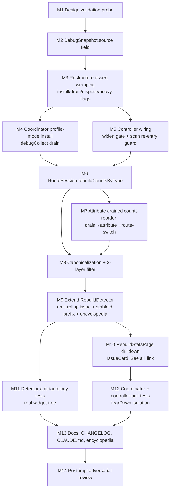

# spec v15 — Rebuild Stats (v0.15.0)

**Status:** plan, not yet implemented. Targets Sleuth v0.15.0, following v0.14.1. The MCP Server feature moves to v0.16.0 (see `doc/spec_v15_mcp_server.md` — file retains its original name; content now targets v0.16.0).

**Scope:** Profile-mode per-widget rebuild counting via `FlutterTimeline.debugCollect()`, attributed to the active `RouteSession`, surfaced as a new `rebuild_hotspot_summary` rollup issue in the existing issue stream. Expanded issue shows top 5 rebuilt widgets inline; a "See all rebuilds" link opens a drilldown page for the active session. Side benefit: four existing detectors (Rebuild, ShallowRebuildRisk, AnimatedBuilder, SetStateScope) gain debug-aware confidence in profile mode for free.

**Mode gate:** Opt-in via existing `SleuthConfig.enableDeepDebugInstrumentation = true`. No new config flag. No-op in release.

## Dependency diagram



## Key design decisions

**KDD-1 — Mutual exclusivity by mode.** `DebugSnapshot.rebuildCounts` is populated by exactly one source per mode: debug → existing `debugOnRebuildDirtyWidget` callback; profile → new `FlutterTimeline.debugCollect()` drain. A new `DebugSnapshot.source` enum (`none | debugCallback | flutterTimeline`) tags the path. Detectors stay mode-agnostic.

**KDD-2 — Restructure assert wrapping (foundational).** Four sites in `sleuth_controller.dart` and `debug_instrumentation_coordinator.dart` wrap profile-relevant code inside `assert(() { ... return true; }())`, which is stripped in profile. Every site gets a top-level mode split **above** the assert:

```dart
if (kDebugMode) { assert(() { /* debug */ return true; }()); }
else if (!kReleaseMode && config.enableDeepDebugInstrumentation) { /* profile */ }
```

Sites: `_installDebugInstrumentation`, `_scanTree` drain (~:1464), `dispose` (~:3066), `_installHeavyFlags` (~:2990), and `DebugInstrumentationCoordinator.install/uninstall` (:71–105).

**KDD-3 — Three-layer filter for non-widget events.**

1. **Emission gate:** set ONLY `debugProfileBuildsEnabledUserWidgets = true` (not the broader `debugProfileBuildsEnabled`). Restricts framework emission to user widgets via `debugIsWidgetLocalCreation`.
2. **Identifier regex:** only `^[A-Z][A-Za-z0-9_]*(<.*>)?$` enters the aggregation map. Drops `'BUILD'`, `'FINALIZE TREE'`, etc.
3. **Explicit deny-list** of known frame-level scopes as belt-and-suspenders.
4. **Generic canonicalization:** strip `<.*>` so `Provider<Foo>` and `Provider<Bar>` collapse to `Provider`, preventing unbounded key explosion from the 200-type cap.

**KDD-4 — Reorder drain, DO NOT flush on route change.** The original "flush on route change" idea double-reset `_lastSnapshotTime` and raced the existing top-of-scan drain. Instead: **reorder `_scanTree` so drained counts are attributed to `_activeRouteSession` immediately after the drain, BEFORE the route-change detection block at :1554.** One drain per scan, no elapsed corruption.

**KDD-5 — Accept and document inflation/rebuild divergence.** Framework emits `FlutterTimeline.startSync('${runtimeType}')` from `_tryRebuild`, `updateChild`, AND `inflateWidget` — so profile-mode counts include initial widget inflations, unlike the debug-mode `debugOnRebuildDirtyWidget` path. Route entry shows transient elevated counts. **Divergence is disclosed in three places:**

1. Inline in the rollup issue's `detail` field ("Counts include initial widget inflations; route entry shows transient spikes.")
2. `SleuthConfig.enableDeepDebugInstrumentation` doc comment.
3. v0.15.0 CHANGELOG migration note.

**KDD-6 — Issue-driven surfacing.**

- Extend the existing `RebuildDetector` to emit one additional `rebuild_hotspot_summary` rollup issue when `debugSnapshot.source == flutterTimeline` AND the active session has a screen-wide hotspot. Existing per-type issues keep firing for single-outlier cases — both coexist by design.
- Rollup issue's `detail` field contains top 5 types sorted by count ("ProductCard × 43\nListItem × 27\n...").
- Rollup issue's `severity`: `warning` at 100–300 total session rebuilds, `critical` at 300+.
- Rollup issue's `confidence`: `confirmed` (only fires when real profile data is present).
- Rollup issue's `stableId`: `rebuild_hotspot_summary`. Must be registered in the controller's stableId prefix map — precedent: v0.10.8 adversarial review caught three missing prefix mappings. Do not repeat that.
- `IssueCard` conditionally renders a "See all rebuilds" link when `issue.stableId == 'rebuild_hotspot_summary'`, mirroring the existing "Ask AI" link pattern.
- Tap opens `RebuildStatsPage` — a new overlay page (mirroring `StartupMetricsPage` at `floating_issues_card.dart:358-363`) that displays the ACTIVE session's full rebuild list, sorted descending. Snapshot taken at open time — does not live-update if the route changes while the page is open.
- No banner. No `activeSessionVersionNotifier`. Issues render through the existing detector-output notifier that already drives `IssueCard` rebuilds per scan.
- No top-level entry point for `RebuildStatsPage`; reachable only from the rollup issue.

**KDD-7 — No schema bump.** `RouteSession.rebuildCountsByType` is a purely additive optional JSON field. Schema stays at v4.

**KDD-8 — Widen coordinator construction gate.** Coordinator is built when `enableDebugCallbacks || enableDeepDebugInstrumentation`. Profile-mode path would otherwise silently never construct.

## v0.15.1 hotfix — KDD-9, KDD-10

**Post-ship discovery.** Shortly after v0.15.0 landed, a real-device profile run on a home screen where DevTools reported ~50–100 rebuilds showed Sleuth's Build Hotspot rollup claiming **21,352** rebuilds. The drilldown was dominated by `FloatingIssuesCard`, `IssueCard`, `TriggerButton`, `Container`, `Padding`, `ValueListenableBuilder`, and `FadeTransition` — every one of them a Sleuth overlay widget or a framework widget used inside the overlay. The v0.15.0 pipeline was measuring itself.

**KDD-9 — Rate-based rollup threshold.** The v0.15.0 rollup gate was absolute: `> 100 session rebuilds` (warning) or `> 300` (critical). On a long-lived route that sits at ~5 rebuilds/sec of baseline chatter, it trips the rollup after twenty seconds even though nothing is actually wrong. Switch to a **sustained-rate** gate:

- `≥ 20 builds/sec` (warning), `≥ 50 builds/sec` (critical).
- `totalRebuilds < 30` noise floor — never fire on a handful of inflations.
- `elapsed < 1500 ms` noise floor — never fire on the route-entry inflation window.
- Rate computed against the detector's own clock (injected for tests) so elapsed is deterministic without touching `DateTime.now()`.
- Title renders sustained rate, absolute total, unique-type count, and window — `"Build Hotspot: 22.0 builds/sec (110 across 4 widgets in 5.0s)"` — so users see the magnitude and the window at once.

**KDD-10 — Framework-widget denylist + CI audit.** The self-measurement bug has a root cause in Flutter's own source: `widget_inspector.dart:1801-1816`'s `_isLocalCreationLocationImpl` naive fallback returns `!file.contains('packages/flutter/')` when `_pubRootDirectories == null` (the default when DevTools is not attached). Anything NOT under `packages/flutter/` — including `package:sleuth/...` — is classified as "user widget" and emitted through `FlutterTimeline.startSync`. `WidgetInspectorService.addPubRootDirectories` is `@protected` and additive-only, so we cannot exclude `package:sleuth` upstream.

The fix is a denylist inside `canonicalizeTypeName`:

1. Added `_frameworkWidgetDenyList` — a const `Set<String>` with every Flutter framework widget constructed inside `lib/src/ui/` (48 entries) and every Sleuth overlay widget class (25 entries, including the private `_StatusRow`, `_CardFooter`, …). Extracted mechanically by grepping the UI source tree, not by inspection.
2. `canonicalizeTypeName` now runs the denylist check **after** generic stripping so `ValueListenableBuilder<int>` collapses to `ValueListenableBuilder` before the set lookup — the filter is now five layers: `_denyList → isRenderObjectName → identifierRegex → genericStrip → frameworkWidgetDenyList`.
3. `test/debug/overlay_denylist_audit_test.dart` — CI gate that walks `lib/src/ui/**/*.dart` and enforces three invariants: (a) every class extending `Stateless/Stateful/InheritedWidget` is in the denylist; (b) every framework widget from a curated `_frameworkCandidates` set that is actually used in UI source is in the denylist; (c) no stale framework entries remain for widgets no longer used. This is the only thing preventing a future overlay addition from silently re-introducing self-measurement.
4. `test/debug/debug_instrumentation_coordinator_profile_test.dart` gets a new `framework widget denylist (KDD-10)` group with three parameterized tests: every entry → `canonicalizeTypeName` returns `null`; generics collapse before denylist check; user widgets with similar-looking names (`ContainerPro`, `MyText`, `PaddedCard`) still pass through unchanged.
5. `@visibleForTesting static Set<String> get debugFrameworkWidgetDenyList` exposes the set to the audit without widening the public API.
6. Disclaimer copy in three places (`rebuild_detector.dart` rollup `detail`, `issue_explanation_builder.dart` encyclopedia `readingTheData`, `rebuild_stats_page.dart` inline banner) now states explicitly that Sleuth overlay widgets are excluded from the drain.

**Why not just rename Sleuth widgets with `_Sleuth` prefix?** Considered and rejected: it would only filter Sleuth's own widgets, not the dozens of framework widgets (`Container`, `Padding`, `ValueListenableBuilder`, …) that Sleuth's overlay instantiates. The framework widgets self-contaminate even if Sleuth's own classes don't — the user's tree also uses `Container`, so a prefix rule can't tell "user's Container" apart from "Sleuth's Container". The denylist drops both deterministically because the profile-mode drain is blind to the emission site.

**Why not `addPubRootDirectories`?** It's additive-only. Adding `package:sleuth` only means "also treat this as a pub root," which is the opposite of the exclusion we need.

**Why does this work where `debugIsWidgetLocalCreation` fails?** The denylist runs in Sleuth, AFTER the framework has already emitted the event into the buffer. We can't suppress emission — we can only drop what we decode. That's why `canonicalizeTypeName` is the chokepoint: every event that reaches the aggregation map passes through it exactly once.

## Implementation steps

### M1. Design-validation probe (throwaway) — 2h
**Theme:** empirical validation · **Impact:** may invalidate KDD-3/KDD-5/thresholds

Write `example/lib/rebuild_stats_probe.dart` that manually installs FlutterTimeline collection, runs for 30s on the cookbook Rebuild Storm demo under `fvm flutter run --profile`, and prints: raw event name frequency histogram, unique type-name count (with and without generic stripping), initial-load vs steady-state counts, wall-clock overhead vs a control run.

**Kill criteria** (any failure → stop and redesign):

- **Overhead ceiling:** > 10% CPU on iPhone SE baseline during sustained scroll.
- **Name-shape:** event names contain non-identifier characters that would defeat the KDD-3 regex.
- **Threshold calibration:** if the cookbook Rebuild Storm demo produces < 100 session rebuilds, the M9 default threshold needs lowering; if > 1000, needs raising.

Delete probe after validation.

### M2. `DebugSnapshot.source` field — 1h
**Theme:** metadata · **Impact:** low

Add `enum RebuildCountSource { none, debugCallback, flutterTimeline }` + `final RebuildCountSource source` on `DebugSnapshot`, default `none` (preserves `const` constructor usage). Debug callback path tags `debugCallback`.

### M3. Restructure assert wrapping — 6h
**Theme:** refactor · **Impact:** high — touches every assert-wrapped debug site

Apply KDD-2 to the four sites plus coordinator internals. In each case, preserve existing debug behavior bit-for-bit; add a profile branch as a currently-empty no-op wired in M4/M5. **Regression gate:** all existing debug-path tests pass unchanged.

### M4. Coordinator profile-mode install + drain — 4h
**Theme:** new code path · **Impact:** medium

Add `installProfileMode()`:

1. Assert `!kReleaseMode`.
2. Save `_prevDebugCollectionEnabled = FlutterTimeline.debugCollectionEnabled`; **throw** if already `true` (DevTools or another Sleuth instance owns it — refuse to stomp).
3. Set `debugCollectionEnabled = true`.
4. Mark `_installedMode = _InstalledMode.profile`.

Add `uninstallProfileMode()`: restore prior value, call `FlutterTimeline.debugReset()`, clear state.

Add `_drainProfileBuffer()` (called from `snapshot()` when mode is profile):

1. `final timings = FlutterTimeline.debugCollect();` (destructive).
2. For each `TimedBlock`, apply the three-layer filter (KDD-3) via a pure static helper `canonicalizeTypeName`.
3. Aggregate into `Map<String, int>`, capped at `_maxTrackedTypes = 200`.
4. Return `DebugSnapshot(rebuildCounts: ..., source: flutterTimeline, elapsed: now - _lastSnapshotTime)`.
5. Update `_lastSnapshotTime = now`.

### M5. Controller wiring + re-entry guard — 3h
**Theme:** integration · **Impact:** medium

- Widen coordinator construction gate to `enableDebugCallbacks || enableDeepDebugInstrumentation` (KDD-8).
- In the restructured `_installDebugInstrumentation`'s profile branch, call `_debugCoordinator.installProfileMode()` when `enableDeepDebugInstrumentation == true`.
- Add `bool _scanInProgress = false`; at the top of `_scanTree`: `if (_scanInProgress) return; _scanInProgress = true;` wrapped in try/finally.

### M6. `RouteSession.rebuildCountsByType` — 2h
**Theme:** data model · **Impact:** low

Add mutable `final Map<String, int> rebuildCountsByType = {}` on `RouteSession`, `int get totalRebuilds`, JSON emits field only when non-empty, `fromJson` tolerates missing field. **No** `activeSessionVersionNotifier` — the existing detector-output notifier already fires per scan. Schema stays at v4 (KDD-7).

### M7. Attribute drained counts (reorder) — 2h
**Theme:** ordering fix · **Impact:** critical correctness

Reorder `_scanTree`:

1. Drain `debugSnapshot = _debugCoordinator?.snapshot()` (existing line ~1466, now post-M3 restructured).
2. **NEW:** if `debugSnapshot?.source == flutterTimeline`, additively merge into `_activeRouteSession?.rebuildCountsByType` HERE, before any route-change logic.
3. Run existing route-detection block (~:1554). Replaced sessions start empty.
4. Continue with detector walk. Detectors still receive the full `debugSnapshot` via `updateDebugSnapshot()`.

`_activeRouteSession == null` path drops counts silently; tested in M12.

### M8. Canonicalization + filter — 2h
**Theme:** data hygiene · **Impact:** medium

Implement `DebugInstrumentationCoordinator.canonicalizeTypeName` as a pure static helper (easy to unit test):

```dart
static final _identifierRegex = RegExp(r'^[A-Z][A-Za-z0-9_]*(<.*>)?$');
static const _denyList = {'BUILD', 'LAYOUT', 'PAINT', 'FINALIZE TREE', 'Preparing Hot Reload (widgets)'};
static String? canonicalizeTypeName(String raw) {
  if (_denyList.contains(raw)) return null;
  if (!_identifierRegex.hasMatch(raw)) return null;
  return raw.replaceAll(RegExp(r'<.*>'), '');
}
```

### M9. Extend `RebuildDetector` with rollup issue — 4h
**Theme:** user-facing feature · **Impact:** high — new issue type

After existing per-type issue emission in `rebuild_detector.dart`:

1. Check `debugSnapshot?.source == flutterTimeline` AND `_activeRouteSession != null`.
2. Compute `totalSessionRebuilds = session.totalRebuilds` and `hotspotCount = session.rebuildCountsByType.length`.
3. If `totalSessionRebuilds > _rollupThreshold` (default 100 per session, calibrated by M1), emit ONE `PerformanceIssue`:
   - `stableId: 'rebuild_hotspot_summary'`
   - `severity: critical` if `> 300` else `warning`
   - `confidence: IssueConfidence.confirmed`
   - `category: IssueCategory.build`
   - `title`: `"Rebuild Hotspot: $totalSessionRebuilds rebuilds across $hotspotCount widgets"`
   - `detail`: top 5 types formatted as `"ProductCard × 43\nListItem × 27\n..."` + trailing inflation-drift disclaimer (KDD-5).
   - `fixHint`: built via `FixHintBuilder.rebuildHotspotSummary()` (new method in `utils/fix_hint_builder.dart`).
   - `confidenceReason`: `"Profile-mode rebuild counts from FlutterTimeline"`.
   - `observationSource: ObservationSource.debugCallbackAndStructural` (closest existing enum).
4. Register `'rebuild_hotspot_summary'` in the controller's stableId prefix map (the v0.10.8 adversarial review gate).

Per-type rebuild issues continue to fire as today — rollup is additive.

### M10. Drilldown page + IssueCard link — 4h
**Theme:** UI · **Impact:** user-visible

- **`lib/src/ui/rebuild_stats_page.dart`** (new): full-page overlay mirroring `StartupMetricsPage` at `floating_issues_card.dart:358-363`. Constructor takes a snapshot of `routeSession.rebuildCountsByType` at open time (active-session only; no live updates if route changes while open). Renders a `ListView` sorted descending by count. Each row: widget type name + count + proportional bar. Empty state: `"No rebuilds recorded for this session."` Uses existing `SleuthTheme` tokens — no hardcoded colors, spacing, or typography. Close button mirrors `StartupMetricsPage` chrome.
- **`lib/src/ui/issue_card.dart`** (edit): inside the expanded body, conditionally render a tappable "See all rebuilds →" link when `issue.stableId == 'rebuild_hotspot_summary'`. Style and semantics mirror the existing "Ask AI" link. Tap handler reads the currently active `RouteSession` from `SleuthController` and pushes `RebuildStatsPage` onto the overlay's Navigator.
- If no active session at tap time (pathological — rollup fired but session was cleared before tap), show a transient snackbar `"Session no longer active"` instead of pushing.

### M11. Detector anti-tautology tests — 4h
**Theme:** test correctness · **Impact:** high — catches real regressions

Resolves the v1 adversarial review E1 finding. Per detector (`rebuild_detector_test.dart`, `animated_builder_detector_test.dart`, `shallow_rebuild_risk_detector_test.dart`, `setstate_scope_detector_test.dart`), add a test group labeled `'real widget tree (anti-tautology)'` that:

1. Pumps a real `TestCounterWidget` via `WidgetTester`.
2. Uses `test/helpers/rebuild_capture_helpers.dart` (new) to hook `debugOnRebuildDirtyWidget` during the test.
3. Triggers 10 rebuilds.
4. Asserts the detector receives real counts and fires the expected issue.

Keep existing hand-coded `const DebugSnapshot` tests as fast-path fixtures (they're fine AS LONG AS the anti-tautology group exists alongside).

Add a new `rebuild_detector_test.dart` group `'rollup issue'`:

- Rollup fires when session total > 100 + source is `flutterTimeline`.
- Rollup does NOT fire when source is `debugCallback` or `none`.
- Rollup does NOT fire when session is null.
- Rollup top-5 is sorted descending by count.
- Rollup detail includes the inflation disclaimer.
- Rollup `stableId` is `'rebuild_hotspot_summary'`.
- Per-type issues still fire alongside the rollup (non-suppression).

### M12. Coordinator + controller unit tests with tearDown isolation — 4h
**Theme:** test infrastructure · **Impact:** medium

**`test/debug/debug_instrumentation_coordinator_profile_test.dart`** (new):

- `setUp` captures `_prev = FlutterTimeline.debugCollectionEnabled`.
- `tearDown` restores and calls `FlutterTimeline.debugReset()`. Applied to every test in the suite (resolves v1 adversarial C6).
- Cases: `installProfileMode` flips the flag; refuses to install when already `true`; `uninstallProfileMode` restores; `snapshot()` filters via canonicalization; aggregation by name; double-install no-op; release-mode short-circuit (covered by constant test); elapsed-time correctness across drains.
- Header comment: documents that widget tests run in `kDebugMode`, so the full profile-mode wiring (`kProfileMode == true`) CANNOT be tested here — M1 probe is the only real validation (resolves v1 adversarial C5).

**`test/controller/sleuth_controller_test.dart`** (edit): scan re-entry regression (two `_scanTree` calls in one microtask, second is no-op); `_currentRouteName() == null` path drops counts silently; drain → attribute → route-switch ordering test.

**`test/ui/issue_card_test.dart`** (edit): "See all rebuilds" link appears only on rollup issue; tap pushes `RebuildStatsPage`; no link on other issue types.

**`test/ui/rebuild_stats_page_test.dart`** (new): empty state; populated state; sorting; close button; snapshot-at-open semantics (mutations to the underlying session don't update the open page).

### M13. Docs, encyclopedia, CHANGELOG, CLAUDE.md — 2h
**Theme:** docs · **Impact:** user-facing

- `SleuthConfig.enableDeepDebugInstrumentation` doc: "In profile mode, records per-widget rebuild counts via FlutterTimeline. Counts include initial widget inflations (KDD-5), so route entry shows transient elevated counts."
- `CHANGELOG.md` v0.15.0: feature entry + migration note for existing `enableDeepDebugInstrumentation=true` users (new rollup issue type may appear in their streams; detector confidence for Rebuild/Shallow/AnimatedBuilder/SetStateScope upgrades in profile mode).
- `CLAUDE.md` current-state bump to v0.15.0, detector count stays at 23 (no new `DetectorType`).
- **New encyclopedia entry** for `rebuild_hotspot_summary` in the issue explanation registry (`lib/src/ui/issue_explanation_builder.dart`'s backing data). Entry has `readingTheData`, `whyItMatters`, `commonCauses`, `howToFix`, `relatedIssues` (bidirectional: links to existing `excessive_rebuilds`, `setstate_scope`, `animated_builder_unscoped`).
- This spec document itself.

### M14. Post-impl adversarial review — 1h

**This is the ONLY place in this document that instructs invoking the adversarial review skill.** Invoke `/adversarial-review` exactly once against the completed implementation, using the attack vectors enumerated in the "Adversarial Review Scope" section below as the review scope. The Scope section itself is a passive scope definition — do not treat it as a second invocation directive.

## Files changed (24 total)

| File | Kind | Change |
|---|---|---|
| `lib/src/debug/debug_snapshot.dart` | Edit | `source` field |
| `lib/src/debug/debug_instrumentation_coordinator.dart` | Edit | Restructure assert; profile install/uninstall/drain; canonicalization |
| `lib/src/controller/sleuth_controller.dart` | Edit | Restructure 4 assert sites; widen gate; reorder drain→attribute→route-switch; `_scanInProgress`; new stableId prefix registration |
| `lib/src/models/route_session.dart` | Edit | `rebuildCountsByType`, `totalRebuilds`, JSON |
| `lib/src/models/sleuth_config.dart` | Edit | Doc comment update |
| `lib/src/detectors/rebuild_detector.dart` | Edit | Rollup issue emission + threshold |
| `lib/src/utils/fix_hint_builder.dart` | Edit | New `rebuildHotspotSummary()` builder |
| `lib/src/ui/issue_card.dart` | Edit | "See all rebuilds" link on rollup issue |
| `lib/src/ui/rebuild_stats_page.dart` | New | Drilldown page |
| `lib/src/ui/issue_explanation_builder.dart` | Edit | Encyclopedia entry for new stableId |
| `lib/sleuth.dart` | Edit | Export `RebuildCountSource` |
| `test/debug/debug_snapshot_test.dart` | Edit | `source` field coverage |
| `test/debug/debug_instrumentation_coordinator_profile_test.dart` | New | Profile lifecycle, canonicalization, tearDown isolation |
| `test/controller/sleuth_controller_test.dart` | Edit | Re-entry, null-route, reorder ordering |
| `test/models/route_session_test.dart` | Edit | `rebuildCountsByType` round-trip |
| `test/detectors/rebuild_detector_test.dart` | Edit | Anti-tautology group + rollup issue group |
| `test/detectors/animated_builder_detector_test.dart` | Edit | Anti-tautology group |
| `test/detectors/shallow_rebuild_risk_detector_test.dart` | Edit | Anti-tautology group |
| `test/detectors/setstate_scope_detector_test.dart` | Edit | Anti-tautology group |
| `test/helpers/rebuild_capture_helpers.dart` | New | `captureDebugCallbackCounts()` helper |
| `test/ui/issue_card_test.dart` | Edit | Rollup link presence/absence + tap |
| `test/ui/rebuild_stats_page_test.dart` | New | Page render + empty + snapshot semantics |
| `example/lib/rebuild_stats_probe.dart` | New (throwaway, deleted after M1) | Probe |
| `CHANGELOG.md` | Edit | v0.15.0 entry + migration note |
| `CLAUDE.md` | Edit | Current-state bump |
| `doc/spec_v15_rebuild_stats.md` | This document | |

## Risk summary

| # | Risk | Sev | Lik | Mitigation |
|---|---|---|---|---|
| R1 | Assert-stripped no-op in profile | **Critical** | Certain-was | M3 top-level mode split, 4 sites |
| R2 | `debugProfileBuildsEnabledUserWidgets` never set in profile today | **Critical** | Certain-was | M3 lifts heavy-flags outside assert |
| R3 | M12 tests artificial code path (can't run in `kDebugMode` widget test) | High | Certain | M12 explicitly documents limitation; M1 probe is the only real profile-mode validation |
| R4 | Elapsed-window corruption from extra `snapshot()` | High | High | KDD-4 reorder eliminates extra drain |
| R5 | Route-change race with drain | High | Med | KDD-4 reorder drain→attribute→route-switch |
| R6 | Test pollution via static `FlutterTimeline._buffer` | High | High | M12 `tearDown` isolation + install-time refusal |
| R7 | Scan re-entry corrupts elapsed | Med | Low | M5 `_scanInProgress` guard |
| R8 | Filter list fragile across Flutter versions | Med | Med | KDD-3 three-layer (emission gate + regex + deny-list) |
| R9 | Generic type names blow up map | Med | Med | KDD-3 strip-generics canonicalization |
| R10 | Inflation vs rebuild semantic drift | Med | Certain | KDD-5 disclosed in issue copy + config doc + CHANGELOG |
| R11 | Coordinator construction gated on wrong flag | High | Certain | KDD-8 widen gate |
| R12 | Rollup stableId missing from prefix map | High | Med | M9 explicitly registers; new `rebuild_detector_test` group asserts it |
| R13 | Encyclopedia entry missing for new issue | Med | Med | M13 adds entry |
| R14 | Per-type + rollup double-firing confuses users | Low | Certain | Accepted; rollup copy labels it as summary ("Rebuild Hotspot: N rebuilds across M widgets") |
| R15 | Drilldown opens while route changes; stale data | Low | Low | M10 snapshot-at-open; documented |
| R16 | Schema v5 rollback trap | Low | Low | KDD-7 stay at v4 |
| R17 | Behavior change for existing `enableDeepDebugInstrumentation=true` users | Low | Med | M13 CHANGELOG migration note |
| R18 | Null `_currentRouteName()` drops counts silently | Low | Low | M12 test + doc note |
| R19 | Overhead exceeds ceiling on animation screens | High | Med | M1 hard kill criterion = 10% on iPhone SE |
| R20 | DevTools conflict on `debugCollectionEnabled` | Med | Low | M4 install-time refusal if already `true` |
| R21 | Rollup threshold (100/session) miscalibrated | Med | Med | M1 probe measures cookbook baseline + default is doc-adjustable |

## Open questions

**None.** All 1–2-pass-resolvable questions closed inline in KDDs 1–8. Deferred items tracked in Remaining Notes.

## Test specifications (per step)

- **M1:** console output; pass = overhead < 10%, name-shape regex holds, thresholds map to cookbook baseline
- **M2:** default `source == none` + debug path tags `debugCallback`
- **M3:** all existing debug-path tests pass unchanged; one new "profile branch entered when `!kDebugMode` simulated" test per restructured site
- **M4:** install flips flag; install refuses if already `true`; `uninstallProfileMode` restores; `_drainProfileBuffer` filters via canonicalization; release-mode short-circuit; elapsed across drains
- **M5:** scan re-entry no-op; coordinator exists when only `enableDeepDebugInstrumentation=true`
- **M6:** default empty; accumulation; JSON round-trip; `toJson` omits empty; `fromJson` tolerates missing
- **M7:** drain → attribute → route-switch ordering — drained counts land on OLD session when route changes mid-scan
- **M8:** `canonicalizeTypeName` unit tests for `'BUILD'`, `'finalize tree'`, `'Foo Bar'`, `'ProductCard'`, `'Provider<Foo>'`, `'_PrivateState'`
- **M9:** rollup fires ONLY when `source == flutterTimeline` AND session non-null AND total > threshold; does NOT fire on `debugCallback` or `none`; top-5 sorted descending; detail contains inflation disclaimer; `stableId` registered in prefix map; per-type issues still fire alongside
- **M10:** page empty state; populated state; sort order; close button; snapshot-at-open (mutations to session don't update open page); `IssueCard` link presence ONLY on rollup; tap pushes page; no link on other issue types
- **M11:** real-widget-tree anti-tautology test per detector — `WidgetTester.pump` with deliberate rebuilds, captured counts, expected issue
- **M12:** coordinator profile lifecycle with `tearDown` isolation; release short-circuit; double-install; scan re-entry regression; null route drop
- **M13:** docs render clean via `fvm flutter analyze`; encyclopedia entry present for new stableId

## Verification

```bash
fvm flutter analyze                      # 0 issues
fvm flutter test                         # full suite, expect 2092 + new tests green
fvm flutter test test/debug/             # coordinator suite isolation
fvm flutter test test/detectors/         # detector + rollup + anti-tautology
fvm flutter test test/ui/                # IssueCard link + drilldown page
cd example && fvm flutter run --profile  # manual smoke: rollup issue appears, top 5 correct, "See all" opens page, kill-criterion CPU check
```

## Plan Review Pass

**Historical record.** This plan has been through two review passes:

- **v1 → `/adversarial-review` (Phase 6 gate):** surfaced three blocking issues (C1/C4/C5) plus six critical/high findings. All folded into v1 KDDs and milestones before presenting.
- **v1 → v2 design pivot (user feedback):** user preferred issue-driven surfacing over a standalone banner. Dropped `_RebuildStatsBanner`, dropped `activeSessionVersionNotifier`, repurposed `RebuildStatsPage` as a drilldown, added KDD-6 (rollup issue via `RebuildDetector` extension).

| Finding | Source | Severity | Where it landed |
|---|---|---|---|
| `_installDebugInstrumentation`, `_scanTree` drain, `dispose`, `_installHeavyFlags` all inside `assert(() {})` — profile code becomes a silent no-op | v1 review C1 | **Blocking** | KDD-2 + M3 restructure 4 sites |
| `debugProfileBuildsEnabledUserWidgets = true` lives inside assert → never set in profile today → feature silently produces zero data | v1 review C4 | **Blocking** | KDD-2 + M3 lifts heavy-flags outside assert |
| M11 "integration test" cannot test real profile-mode path (widget tests run in `kDebugMode`) | v1 review C5 | **Blocking** | M12 reframes: pure-logic tests + documented limitation; M1 probe is the only real validation |
| Extra `snapshot()` on route change resets `_lastSnapshotTime` twice → elapsed corruption for rate-based detectors | v1 review C2 | Critical | KDD-4 removes extra flush; reorders drain→attribute→route-switch |
| Route-change flush races drain at :1466 (redundant + racy) | v1 review C3 | Critical | Same KDD-4 reorder |
| Test pollution via static `FlutterTimeline._buffer` | v1 review C6 | Critical | M12 `tearDown` isolation + M4 install-time refusal |
| `_scanTree` re-entry not guarded | v1 review H1 | High | M5 `_scanInProgress` guard + test |
| Hardcoded filter list fragile across Flutter versions | v1 review H2 | High | KDD-3 three-layer filter |
| Generic type names produce unbounded keys | v1 review H3 | High | KDD-3 strip-generics canonicalization |
| Profile mode counts inflations, debug mode doesn't — semantic drift | v1 review H4 | High | KDD-5 accepts divergence; **inlined disclaimer in issue copy** (v2 strengthening), config doc, CHANGELOG |
| Coordinator construction gated on `enableDebugCallbacks`, not `enableDeepDebugInstrumentation` | v1 review H5 | High | KDD-8 + M5 widen gate |
| M14 adversarial review scope empty | v1 review H6 | High | Adversarial Review Scope section below |
| No overhead kill criterion | v1 review Med1 | Medium | M1 names 10% CPU on iPhone SE |
| `routeHistoryNotifier` won't rebuild banner per-scan | v1 review Med2 | Medium | **Obsolete in v2** — dropped banner entirely, no notifier needed (issues render via existing detector-output notifier) |
| Schema v5 rollback trap | v1 review Med3 | Medium | KDD-7 stay at v4 |
| Existing `enableDeepDebugInstrumentation=true` users see behavior change | v1 review Med4 | Medium | M13 CHANGELOG migration note |
| Null `_currentRouteName()` drops counts silently | v1 review Med5 | Medium | M12 test + M13 doc |
| **v2:** Rollup stableId must be registered in prefix map | v2 design pivot | High | M9 explicit registration + test; precedent: v0.10.8 caught 3 missing prefixes |
| **v2:** Encyclopedia entry for new issue type | v2 design pivot | Medium | M13 encyclopedia addition |
| **v2:** Per-type + rollup double-firing | v2 design pivot | Low | User confirmed acceptable; M9 copy labels rollup as summary |
| **v2:** Drilldown opens as route changes → stale data | v2 design pivot | Low | M10 snapshot-at-open semantics |

**Fix-attacks (Tactic 8, second-order on the v2 delta):**

- *Could the rollup threshold under-fire on slow devices?* Yes — slow devices have fewer frames per window. Mitigation: threshold is per-session total, not per-window-rate, so device speed doesn't affect it.
- *Could the "See all" link leak `RouteSession` if the user backgrounds the app while the page is open?* Only if the page holds a strong reference after active session changes. Snapshot-at-open means the page owns its own `Map<String,int>` copy, not a reference to the live session — safe.
- *Could registering a new `stableId` prefix break the ranker?* The ranker uses category/severity/confidence — new stableId is transparent to it. Tested in M9.
- *Could the "See all" link be tapped on a stale card after the session is cleared?* Yes — handled by M10's snackbar fallback.

## Adversarial Review Scope

**This section is a passive scope definition, not an invocation directive.** The adversarial review skill is called exactly once during implementation — in M14 — and M14 uses the attack vectors below as its scope. Phase 6 review already ran during planning (see Plan Review Pass historical record). No intermediate milestone should treat this section as a trigger.

Attack vectors for M14 to exercise:

1. **Assert-restructure correctness (M3)** — every site preserves debug behavior unchanged. Hunt for leftover `assert(() {})` blocks in `DebugInstrumentationCoordinator` that should have been lifted. Run existing debug-path tests with no changes.
2. **`FlutterTimeline` lifecycle hygiene (M4, M12)** — install refuses on already-set flag; uninstall restores; `debugReset()` called in `tearDown` across ALL test files (not just the new suite); no static-state leakage between tests.
3. **Reorder correctness (M7)** — drained counts land on OLD `_activeRouteSession` during route-change scans, verified by test.
4. **Semantic drift visibility (KDD-5)** — route entry on cookbook demos does show elevated counts. Issue copy and drilldown page are unambiguous about inflations. Would a user misread "ProductCard × 43" as "43 rebuilds of a stable widget"? Attack the UX copy.
5. **Three-layer filter (KDD-3, M8)** — deliberately emit `FlutterTimeline.startSync('CUSTOM SCOPE')` from a local patch; verify it's dropped. Verify `Provider<Foo>` canonicalizes to `Provider`. Verify `_Private` identifiers drop (intentional).
6. **Transitive detector behavior** — run cookbook in profile mode with `enableDeepDebugInstrumentation=true`. For Rebuild, ShallowRebuildRisk, AnimatedBuilder, SetStateScope: (a) no new false positives beyond documented inflation spikes; (b) confidence upgrades are real; (c) thresholds not overwhelmed.
7. **Rollup issue behavior (M9)** — rollup fires only when source is `flutterTimeline` and session non-null and threshold crossed; stableId registered in prefix map; encyclopedia entry resolves; rollup ranks correctly alongside per-type issues.
8. **Drilldown page and link (M10)** — "See all rebuilds" link appears ONLY on the rollup issue; tap pushes the page; page shows active-session data sorted descending; close button returns cleanly; no null-pointer on empty session; snapshot-at-open semantics hold (mutations to the underlying session don't update an open page).
9. **Dispose ordering** — `dispose()` calls `uninstallProfileMode` BEFORE `_restoreHeavyFlags`, so `debugCollect()` is never called against a reset state.
10. **Overhead on real device** — re-run M1's probe against final code. Sustained overhead < 10% on cookbook Rebuild Storm demo.
11. **Test fixture audit (Tactic 9)** — every new test file audited for fixture tautology. Hand-coded `const DebugSnapshot` tests are acceptable ONLY alongside a real-widget-tree anti-tautology test in the same file (M11 requirement).

Findings from the M14 invocation append to this document as a "Post-impl adversarial review" section. Fixes ship in the same v0.15.0 release before publishing.

## v0.15.2 post-impl adversarial review

The v0.15.2 panel refactor (replacing the rollup IssueCard + chip with a single inline expandable `_RebuildStatsBanner`) went through its own `/adversarial-review` pass after implementation. The reviewer surfaced **12 findings** — 3 critical, 4 high, 4 medium, 1 test-fixture contract gap. All shipped in v0.15.2 before publish.

| # | Sev | Finding | Fix |
|---|---|---|---|
| C1 | **Critical** | Paused-snapshot drift: `See all N →` reached back to `controller.activeRouteSession.rebuildCountsByType` at open time, so a paused panel could open a drilldown with *live* counts from a different moment | `_RebuildStatsBanner.onTap` signature changed to `void Function(Map<String, int>? overrideCounts)`. Footer GestureDetector passes `_paused ? _frozenCounts : null`. `_FloatingIssuesCardState._onSeeAllRebuildsTap` honours the override before falling back to `session?.rebuildCountsByType` |
| C2 | **Critical** | Redundant `See all 2 →` link on small routes — a two-widget route showed the rows AND a link below the same two rows | Footer link now gated on `widgetCount > _topN` (3). Small routes show their rows and stop there |
| C3 | **Critical** | Stale test docstrings + group comment in `floating_issues_card_test.dart` still referenced the removed `_rollupMinTotalForRate = 30` rate gate and "rollup IssueCard" surfacing path | Group docstring rewritten for the v0.15.2 panel-only contract; "always-on contract" test renamed; rollup constant references removed |
| H1 | High | Tap targets ~12–14dp on pause toggle and See-all link — well below Material's 48dp ideal *and* below the inline-overlay's own ~28dp practical floor | Pause toggle wrapped in `SizedBox(28, 28)` with `HitTestBehavior.opaque + Center`; See-all wrapped in `SizedBox(height: 24)` with the same. Per-row vertical padding tightened to `2dp` and bar height shrunk from `3` to `2` to keep the panel inside the test card's 330dp budget. Documented compromise vs Material 48dp ideal — acceptable for an always-on debug overlay where vertical real estate is precious |
| H2 | High | Silent auto-resume: pause auto-cleared on route change (correct behaviour) but bar charts just started moving again with no user feedback | `_RebuildStatsBannerState._onRouteSessionChanged` fires `widget.onPauseDiscarded()` before clearing pause state. Parent renders a 2 s "Pause cleared — route changed" snackbar via the existing `_rebuildSessionGoneVisible` pattern (new `_rebuildPauseDiscardedVisible` flag + timer pair) |
| H3 | High | KDD-5 disclosure regression: the `incl. inflations` footnote lives inside the *expanded* footer, so a user who never expanded the panel had no signal that the count includes inflations | Initial fix added an `Icons.info_outline` (12dp) glyph next to the collapsed count. **Reverted on user feedback** — the non-interactive icon visually competed with the existing `Icons.repeat` rebuild glyph already in the same row. Caveat now lives only in the expanded footer and on `RebuildStatsPage` (accepted tradeoff: collapsed users miss the caveat until they expand, in exchange for a cleaner always-visible header) |
| H4 | High | Empty-state debuggability — what does the user see if they tap See-all on a freshly-cleared session? | Verified existing `_rebuildSessionGoneVisible` snackbar still fires through the C1 callback signature change. No code change needed beyond the C1 refactor |
| F1 | Medium | Collapsed-state pause indicator: a paused panel could be collapsed and forgotten | Collapsed header now renders `Icons.pause` (10dp, alpha 0.5) next to the count when `_paused` is true |
| F2 | Medium | `TweenAnimationBuilder<int>` with `IntTween(begin: 0, end: count)` looked wrong on rebuild — surely `begin: 0` resets the tween every scan? | Audited Flutter source: `TweenAnimationBuilder` substitutes the *current animated value* as the new `begin` on rebuild. `begin: 0` is the seed-only value used on first build. Canonical pattern, no code change |
| F3 / P3 | Medium | `Listenable.merge([issuesNotifier, routeHistoryNotifier])` allocated a fresh listenable on every banner rebuild | Hoisted into `late final Listenable _mergedListenable` initialised once in `initState` |
| TF2 | Test-fixture | The pause test asserted that the *panel* froze its rendered counts but did not assert the drilldown opened with frozen data — the contract that motivates pause was never tested | Test extended: pause → mutate live counts → tap "See all 4 →" → assert drilldown shows frozen `15`/`×8`, NOT live `20`/`×13`. Uses `find.descendant(of: find.byType(RebuildStatsPage), matching: ...)` to disambiguate panel vs drilldown text matches when both are mounted simultaneously |

**Verification:**

- `fvm flutter test` → 2,146 passing
- `fvm flutter analyze` → 0 issues
- `cd example && fvm flutter test` → 9 passing
- Grep verified no stale `updateActiveRouteSession` overrides remain in `lib/` or `example/`

**Self-critique notes** (what the post-impl pass did NOT catch and is left to a future review):

- No real-device profile run was performed against this v0.15.2 panel — the v0.15.0 → v0.15.1 → v0.15.2 cycle was driven by user reports, not by us re-running the M1 probe. If the panel introduces a measurable per-scan cost on a low-end device, we will not learn that until the next user report.
- The H1 compromise (28dp / 24dp instead of 48dp) is an explicit deviation from Material guidelines. Rationalised in code comments but not measured against actual finger-target failure rates on a touch device.

## Remaining notes

- **MCP follow-up:** once v0.16 MCP ships, add `rebuildCountsByType` and `rebuild_hotspot_summary` issue to `get_route_health` / `get_issues` MCP responses. Tracked as a v0.16.1 follow-up, not in scope here.
- **v2 roadmap items (deferred):** precise route-straddling split via `timedBlocks[].start` timestamps; on-demand toggle instead of always-on; inflation-vs-rebuild filtering via per-element first-build tracking; all-sessions view in drilldown page.
- **M1 kill criterion reminder:** if the probe exceeds 10% CPU on iPhone SE OR name-shape assumptions break OR cookbook baseline falls outside `100 <= totalRebuilds <= 1000`, STOP and return to KDD design. Do not push through.
- **Scope trimmed vs v1:** banner + top-level page entry point dropped → roughly −5h UI work, −1 file (`floating_issues_card.dart` edit removed), −1 test file (`rebuild_stats_banner_test.dart`). Rollup detector + drilldown added ≈ +5h, so net effort unchanged but complexity better organized.
